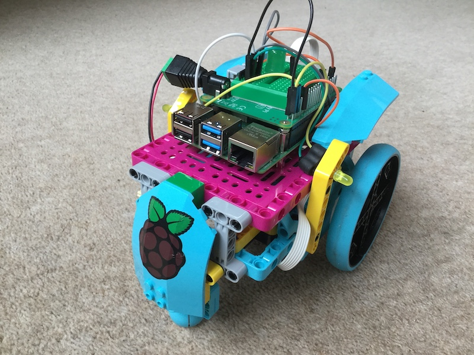

## Einleitung

Verwende LEGO® und den Raspberry Pi Build HAT, um ein Roboterauto zu bauen. Programmiere es dann so, dass du es mit einer Bluetooth-Verbindung von deinem Android-Telefon aus steuern kannst. Füge dann einige LEDs hinzu, um deinen Freunde zu imponieren.

Der Name [Bluetooth](https://de.wikipedia.org/wiki/Bluetooth) wurde 1997 von Jim Kardach von Intel vorgeschlagen. Zum Zeitpunkt dieses Vorschlags las er Frans G. Bengtssons historischen Roman *The Long Ships* über die Wikinger und den dänischen König Harald Blauzahn (bluetooth) aus dem 10. Jahrhundert. Blauzahn war der Spitzname von König Harald, und er vereinte die dänischen Stämme zu einem einzigen Königreich, so wie Bluetooth Kommunikationsprotokolle vereint.

Du wirst:
+ LEGO® Technic™ Motoren mit dem Raspberry Pi Build HAT steuern
+ Mittels Bluetooth Signale an den Raspberry Pi senden
+ Lernen wie du LEDs auf dem Raspberry Pi mit gpiozero steuern kannst

--- no-print ---

--- /no-print ---

Du baust ein Auto mit Rädern. Seine Bewegung wird von zwei getrennt angetriebenen Rädern auf beiden Seiten des Autos bestimmt. Das ermöglicht es ihm, sich vorwärts und rückwärts zu bewegen und zu drehen. Optional kannst du dem Auto LEDs hinzufügen, die als Bremslicht, Blinker oder Scheinwerfer fungieren.

--- print-only ---

--- /print-only ---

### Was du noch brauchst

+ Einen Raspberry Pi-Computer mit der neuesten Desktop-Version von Raspberry Pi OS
+ Ein Raspberry Pi Build HAT
+ 2× LEGO® Technic™ Motoren
+ Ein Sortiment von LEGO®-Teilen, einschließlich Rädern (wir haben eine Auswahl aus dem [LEGO® Education SPIKE™ Prime-Set verwendet](https://education.lego.com/en-gb/product/spike-prime))
+ Ein Android-Handy oder -Tablet
+ 5× AA-Batterien und einen Batteriehalter mit einem Hohlstecker
+ Socket-to-pin jumper leads (optional)
+ LEDs (optional)

### Software

+ Build HAT Python-Bibliothek zur Steuerung des Build HAT
+ Blue Dot Python-Bibliothek und Blue Dot Android-App
+ gpiozero Python-Bibliothek

--- collapse ---
---
title: Zusätzliche Informationen für Pädagogen
---

Sie können das fertige Projekt [hier](https://rpf.io/p/en/bt-robot-car-go) herunterladen.

Wenn Sie dieses Projekt ausdrucken möchten, verwenden Sie bitte die [druckerfreundliche Version](https://projects.raspberrypi.org/en/projects/bt-robot-car/print){:target="_blank"}.

--- /collapse ---

Bevor du beginnst, musst du deinen Raspberry Pi-Computer eingerichtet und deinen Build HAT aufgesteckt haben:

--- task ---

Montiere deinen Raspberry Pi mit M2-Schrauben und Muttern auf der LEGO Build Plate und stelle sicher, dass sich der Raspberry Pi auf der flachen Seite befindet:

 

--- /task ---

Die Montage des Raspberry Pi auf diese Weise ermöglicht einen einfachen Zugriff auf die Anschlüsse und den SD-Kartensteckplatz. Mit der Bauplatte kannst du den Raspberry Pi einfacher mit der Hauptstruktur deines Dashboards verbinden.

--- task ---

Richte den Build HAT mit dem Raspberry Pi aus und stelle sicher, dass du den Text `This way up` siehst. Stelle sicher, dass alle GPIO-Pins vom Stecker des HAT bedeckt sind, und drücke ihn fest nach unten. (Das Beispiel verwendet einen [Stacking-Header](https://www.adafruit.com/product/2223){:target="_blank"}, der die Pins verlängert.)

 

--- /task ---

Jetzt solltest du deinen Raspberry Pi über die 7,5-V-Hohlstecker-Buchse des Build HAT mit Strom versorgen, damit du die Motoren verwenden kannst.

--- task ---

Wenn du dies noch nicht getan hast, richte deinen Raspberry Pi ein, indem du diesen Anweisungen folgst:

[Einrichten deines Raspberry Pi](https://projects.raspberrypi.org/en/projects/raspberry-pi-setting-up){:target="_blank"}

--- /task ---

--- task ---

Nachdem der Raspberry Pi gebootet hat, öffne das Raspberry Pi Configuration Tool, indem du auf die Schaltfläche Raspberry Menu (Himbeere) klickst und dann „Einstellungen“ und dann „Raspberry Pi Konfiguration“ auswählst.

Klicke auf die Registerkarte "Schnittstellen" und passe die seriellen Einstellungen wie unten gezeigt an:

--- /task ---

--- task ---

Du musst auch die buildhat Python-Bibliothek installieren, indem du diese Anweisungen befolgst:

--- collapse ---
---
title: Installation der buildhat Python-Bibliothek
---

Öffne ein Terminalfenster auf deinem Raspberry Pi, indem du <kbd>Strg</kbd>+<kbd>Alt</kbd>+<kbd>T</kbd>drückst.

Gib an der Eingabeaufforderung `sudo pip3 install buildhat` ein

Drücke <kbd>Enter</kbd> und warte auf die Meldung "Installation abgeschlossen".

--- /collapse ---

--- /task ---
