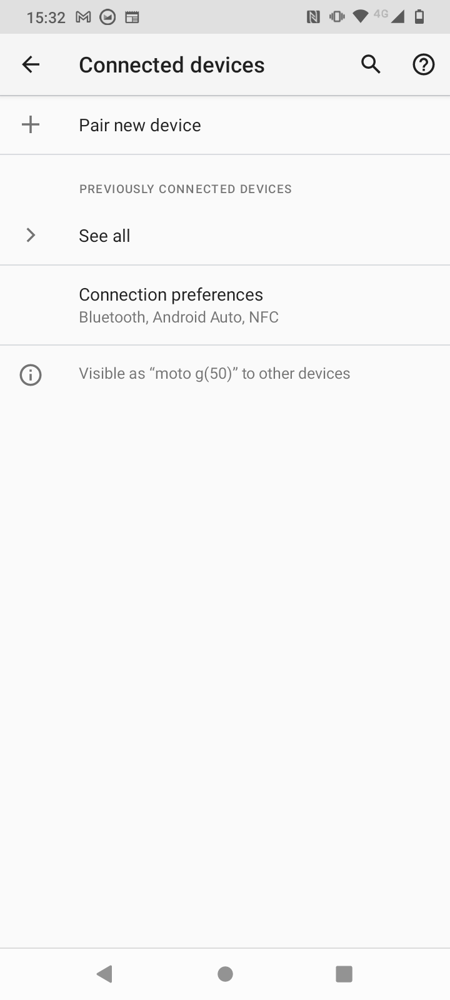
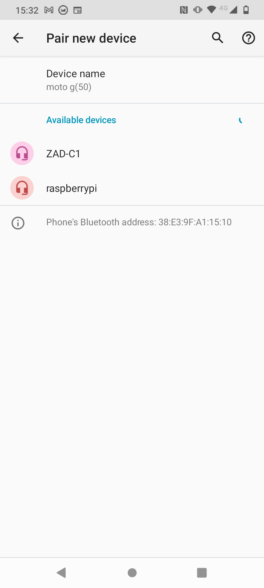
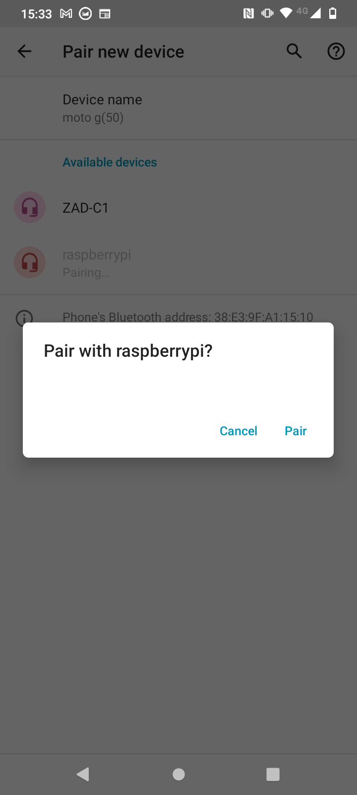
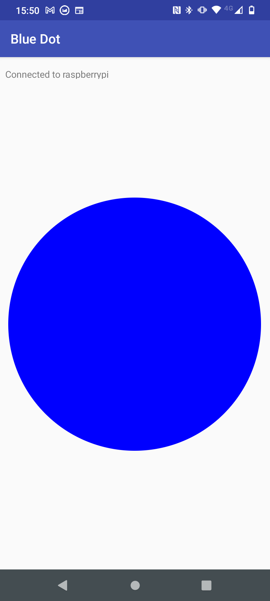
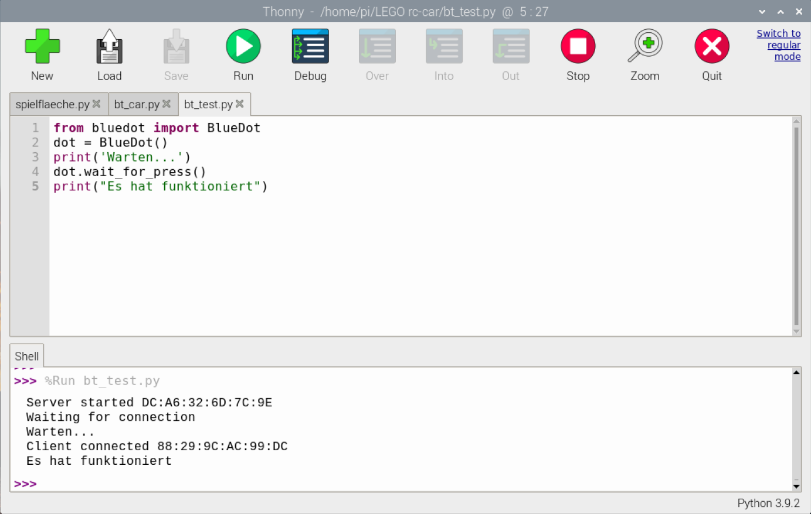

## Bluetooth-Steuerung einrichten und testen

Um dein Auto aus der Ferne zu steuern, verwendest du die Blue Dot-Bibliothek und die Android-App. Du solltest deinen Raspberry Pi und dein Mobilgerät nur einmal koppeln müssen. Danach sollten sie sich jedes Mal problemlos verbinden.

--- collapse ---
---
title: Installation der Blue Dot Python-Bibliothek
---

--- task ---

Öffne ein Terminalfenster. Gib an der Eingabeaufforderung ein
```
sudo pip3 install bluedot
```
und drücke <kbd>Enter</kbd>.

--- /task ---

Dein Terminal sollte anzeigen, dass die neueste Version von Blue Dot installiert ist.

--- /collapse ---

### Pairing deines Raspberry Pi mit deinem Android-Gerät

--- task ---

Klicke auf das Bluetooth-Symbol in der oberen rechten Ecke des Desktops und stelle sicher, dass Bluetooth **On** und das Gerät **Discoverable** ist.


--- /task ---

Abhängig von der Android-Version, die du verwendest, können die auszuführenden Schritte auf deinem Gerät geringfügig abweichen, sollten jedoch in etwa so sein:

--- task ---

**Einstellungen | Verbindungen | Bluetooth** findest du deine Bluetooth-Einstellungen und dann **Verbundene Geräte** oder <0>Verfügbare Geräte</0>.



--- /task ---

--- task ---

Wähle **Neues Gerät koppeln** und wähle dann dein Raspberry Pi-Gerät aus den angezeigten Geräten aus.



Wähle dann **Kopplung** aus der Dialogbox.



--- /task ---

--- task ---

Auf dem Raspberry Pi solltest du aufgefordert werden, die Kopplungs-Anfrage zu akzeptieren.


Ein Klick auf **OK** sollte eine erfolgreiche Kopplung des Raspberry Pi und der Android-Geräte anzeigen.


--- /task ---

Möglicherweise wirst du auch aufgefordert, einen Code zu bestätigen, bevor du die Geräte koppeln darfst.


### Blue Dot testen

--- task ---

Erstelle auf deinem Raspberry Pi eine neue Python-Datei namens bluedot_test.py mit dem folgenden Code.

--- code ---
---
language: python filename: bluedot_test.py line_numbers: true line_number_start:
line_highlights:
---

from bluedot import BlueDot   
dot = BlueDot()

print('Warten...')   
punkt.wait_for_press()    
print("Es hat funktioniert")

--- /code ---

--- /task ---

--- task ---

Führe das Programm aus und öffne dann auf deinem Android-Gerät die [Blue Dot](https://play.google.com/store/apps/details?id=com.stuffaboutcode.bluedot&hl=en_GB&gl=US) App. Der erste Bildschirm zeigt dir eine Liste der Bluetooth-Geräte, die mit deinem Gerät gekoppelt wurden.


--- /task ---

--- task ---

Klicke auf **raspberrypi** und du solltest dann einen großen blauen Punkt auf deinem Bildschirm sehen. Tippe auf den Punkt.



--- collapse ---
---
title: Bluedot wählt meinen Raspberry Pi nicht aus
---

 Damit BlueDot eine Verbindung zu deinem Raspberry Pi herstellen kann, muss ein Server auf dem Raspberry Pi laufen. This means that a BlueDot object (`dot = BlueDot()`) must have already been created in your Python program and be waiting for connections.

 Stelle sicher, dass du dein Programm ausführst, bevor du versuchst, eine Verbindung mit Bluedot herzustellen, und dass es keine Fehler hat.

--- /collapse ---

--- /task ---

--- task ---

Auf dem Raspberry Pi solltest du sehen, dass dein Programm die Bluetooth-Verbindung akzeptiert und erfolgreich auf das Drücken des blauen Punktes reagiert hat.



--- /task ---
