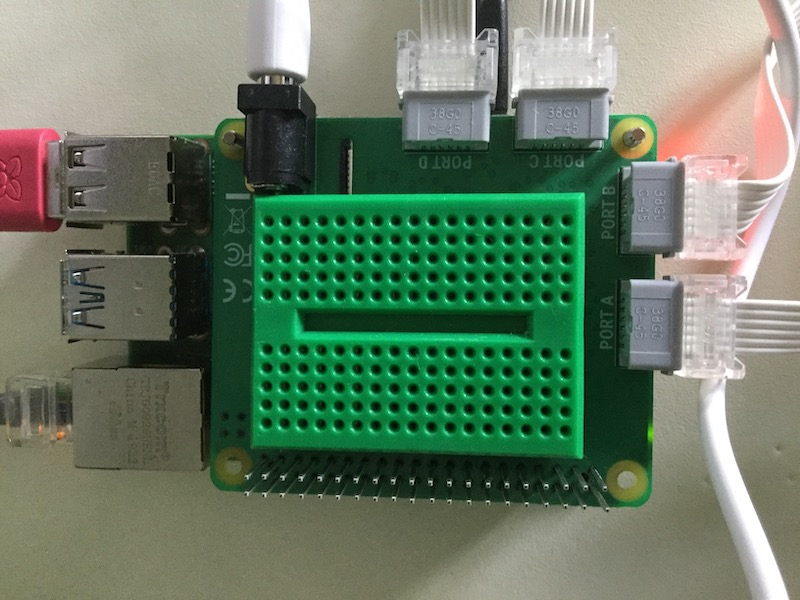

## Hinzufügen einiger LEDs

Die Löcher in LEGO® Elementen haben genau die richtige Größe, um kleine LEDs zu halten, sodass du sie leicht zu deinem Projekt hinzufügen kannst. Alternativ kannst du ein Steckbrett verwenden.

Es gibt viele Möglichkeiten, ein Steckbrett mit LEGO® zu montieren. Ein paar Ideen werden unten gezeigt, aber du kannst alle Elemente verwenden, die dir zur Verfügung stehen.

Du kannst ein kleines Steckbrett verwenden und es in den Raum auf deinem HAT setzen. Viele Steckbretter haben an der Unterseite einen Klebestreifen, mit dem du es fest auf den HAT kleben kannst. Wenn du eine [Raspberry Pi-Kamera](https://projects.raspberrypi.org/en/projects/getting-started-with-picamera) zu deinem Projekt hinzufügen möchtest musst du aber beachten, dass dadurch der Schlitz, der für das Kamerakabel verwendet wird, teilweise bedeckt wird.

--- task ---

Verwende dein Steckbrett, um zwei oder mehr LEDs an deinen Raspberry Pi anzuschließen. Im folgenden Beispiel werden die Pins 20 und 21 auf dem Raspberry Pi verwendet.

--- /task ---

[[[rpi-gpio-pins]]]

[[[rpi-connect-led]]]

Bei Bedarf kannst du zusätzliche Steckbrücken verwenden, um die LEDs zu verlängern.

Zusätzlich können die LEDs in das LEGO® Element deiner Wahl eingesetzt werden. Wenn du feststellst, dass die Beine der LEDs zu nah beieinander liegen oder sich berühren, kannst du eines mit etwas Klebeband isolieren, um einen Kurzschluss zu vermeiden.

--- task ---

Ändere deinen Code, um das Objekt `LED` von `gpiozero` zu importieren und die LEDs einzurichten.

--- code ---
---
language: python filename: bt_car.py line_numbers: true line_number_start:
line_highlights: 4, 9, 10
---

from buildhat import Motor    
from bluedot import BlueDot    
from signal import pause     
from gpiozero import LED

motor_links = Motor('A')     
motor_rechts = Motor('B')     
punkt = BlueDot()     
led_links = LED(20)     
led_rechts = LED(21)

--- /code ---

--- /task ---

--- task ---

Ändere deinen Code so, dass die LEDs je nach Bewegung des Autos leuchten. Im Beispiel unten leuchten beide LEDs, wenn das Auto rückwärts fährt oder stoppt. Sie schalten sich aus, wenn das Auto vorwärts fährt. Die linke LED blinkt, wenn das Auto nach links fährt und die rechte LED blinkt, wenn das Auto nach rechts fährt.

--- code ---
---
language: python filename: bt_car.py line_numbers: true line_number_start: 13
line_highlights: 16, 17, 23, 24, 30, 31, 37, 38, 44, 45
---

def stop():    
motor_links.stop()     
motor_rechts.stop()    
led_rechts.on()     
led_links.on()

def vorwaerts():    
motor_links.start(-100)    
motor_rechts.start(100)    
led_rechts.off()    
led_links.off()

def zurueck():    
motor_links.start(100)    
motor_rechts.start(-100)    
led_rechts.on(0.2)    
led_links.on(0.2)

def rechts():    
motor_links.start(-100)    
motor_rechts.start(-100)    
led_rechts.blink(0.2)    
led_links.off()

def links():    
motor_links.start(100)    
motor_rechts.start(100)    
led_rechts.off()     
led_links.blink(0.2)

--- /code ---

--- /task ---

Du kannst deiner Fantasie freien Lauf lassen, um die LEDs nach Belieben einzuschalten oder blinken zu lassen.

--- save ---
