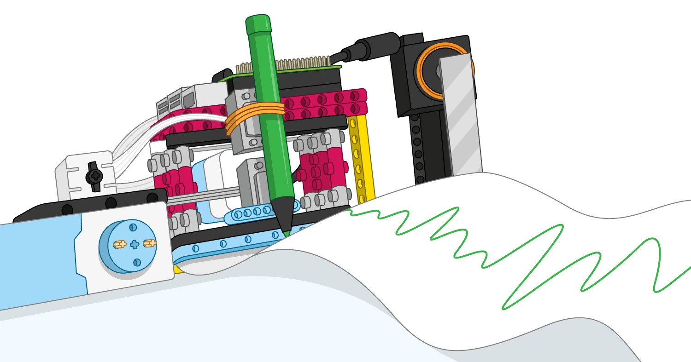

## Wie geht es weiter?

Wenn du dein Bluetooth-Auto aufwerten möchtest, kannst du darüber nachdenken, weitere elektronische Komponenten hinzuzufügen:

+ Füge zusätzliche LEDs als blinkende Polizeilichter oder Scheinwerfer hinzu, wenn das Auto fährt

+ Viele Fahrzeuge machen beim Rückwärtsfahren Geräusche, sodass du deinem Projekt einen Summer hinzufügen könntest

+ Du könntest sogar einen Ultraschall-Abstandssensor (UDS) verwenden, der erkennt, wenn sich das Auto einem Hindernis nähert, und automatisch verhindert, dass es zusammenstößt!

Wenn du dem Weg [Einführung in LEGO BuildHAT](https://projects.raspberrypi.org/de-DE/pathways/lego-intro) folgst, kannst du mit dem [LEGO Daten Plotter](https://projects.raspberrypi.org/de-DE/projects/lego-plotter) Projekt fortfahren. In diesem Projekt erstellen Sie einen Datenplotter, der auf Papier zeichnet!

***
Dieses Projekt wurde von freiwilligen Helfern übersetzt:

Karl Schuh

Dank freiwilliger Helfer können wir Menschen auf der ganzen Welt die Möglichkeit geben, in ihrer eigenen Sprache zu lernen. Du kannst uns helfen, mehr Menschen zu erreichen, indem Du dich freiwillig zum Übersetzen meldest - weitere Informationen unter [rpf.io/translate](https://rpf.io/translate).
