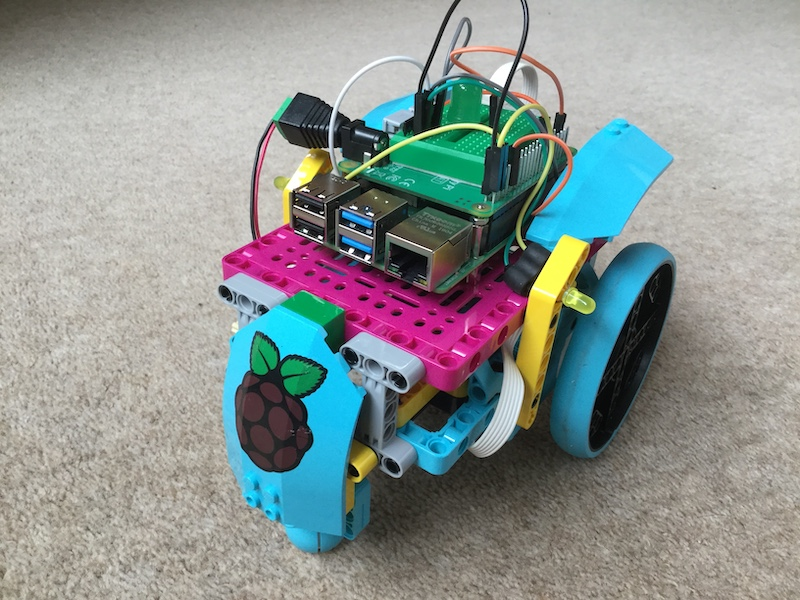

## Introduction

Use LEGO and the Raspberry Pi Build HAT to build a cool robot car, then program it for Bluetooth control from your phone. Then add some LEDs to dazzle your friends.

--- no-print ---

--- /no-print ---

You will be building a differential wheeled robot. It's movement will be based on two separately driven wheels placed on either side of the robot body. It will be able to change its direction by varying the relative rate of rotation of each wheel and so will not require an additional steering mechanism.

### What you will make

In this project you will build a robot buggy that you can program to move around using simple Python commands.

--- print-only ---

--- /print-only ---

Throughout the project you’ll work towards this example robot car and model how it is built. However, you can build your robot car using whatever LEGO and other materials you have available.

--- collapse ---
---
title: What you will need
---
### Hardware

+ A Raspberry Pi Computer running the latest Desktop version of Raspberry Pi OS
+ A Raspberry Pi Build HAT
+ 2 Lego Technic Motors
+ A small breadboard
+ Some LEDs and 100 ohm resistors
+ Some breadboard jumper leads
+ Assortment of LEGO, including two wheels.  We used a selection from the [LEGO Spike Prime kit](https://education.lego.com/en-gb/product/spike-prime)
+ An Android mobile phone or tablet
+ If your Raspberry Pi computer doesn't have built-in Bluetooth you will also need a USB Bluetooth adapter.
+ Five AA batteries and a holder pack with a barrel jack. 

### Software

+ Buildhat python library for controlling the Build Hat
+ Bluedot Python library and Bluedot Android app
+ Gpiozero Python library

### Downloads

+ [rpf.io/project-name-go](http://rpf.io/project-name-go){:target="_blank"}

--- /collapse ---

--- collapse ---
---
title: What you will learn
---

+ To control LEGO motors using the Raspberry Pi Build HAT
+ How to add Bluetooth control
+ How to blink and LED using gpiozero

--- /collapse ---

--- collapse ---
---
title: Additional information for educators
---

If you need to print this project, please use the [printer-friendly version](https://projects.raspberrypi.org/en/projects/project-name/print){:target="_blank"}.

[Here is a link to the resources for this project](http://rpf.io/project-name-go).

--- /collapse ---
