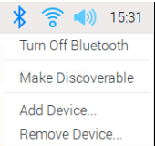

## Setup and test the Bluetooth control

To remotely pilot your car, you're going to use the Blue Dot library and Android app.

### Pairing your Raspberry Pi with your Android device

--- task ---

Click on the Bluetooth icon in the top right hand corner of the desktop and make sure that Bluetooth is turned **On** and that the device is **Discoverable**

--- /task ---

Depending on the version of Android you are running, the steps to follow on your device may vary slightly but should be close to:

--- task ---

In **Settings** find your Bluetooth settings and then **Connected Devices**

--- /task ---

--- task ---

Choose **Pair new device** and then select your Raspberry Pi device from the devices shown.

Then choose **Pair** from the dialogue box.

--- /task ---

--- task ---

On the Raspberry Pi, you should be prompted to accept the pairing request.

Clicking on **OK** should show a successful pairing of the Raspberry Pi and the Android device.

--- /task ---

Sometimes you might be asked to confirm a code before you are allowed to pair the devices.

### Testing Blue Dot

--- task ---

Create a new Python file on your Raspberry Pi called bluedot_test.py, with the following code.

--- code ---
---
language: python
filename: bluedot_test.py
line_numbers: true
line_number_start: 
line_highlights: 
---
from bluedot import BlueDot
bd = BlueDot()

print('Waiting...')
bd.wait_for_press()
print("It worked!")
--- /code ---

--- /task ---

--- task ---

Run the program and then on your Android device open the [Blue Dot](https://play.google.com/store/apps/details?id=com.stuffaboutcode.bluedot&hl=en_GB&gl=US) app. The first screen will show you a list of Bluetooth devices that have been paired with your device.

--- /task ---

--- task ---

Click on **raspberrypi** from the menu and you should then see a big blue dot on your screen. Tap the dot.

--- /task ---

--- task ---

On the Raspberry Pi you should see that your program has accepted the Bluetooth connection and successfully responded to you pressing the blue dot.  

--- /task ---
