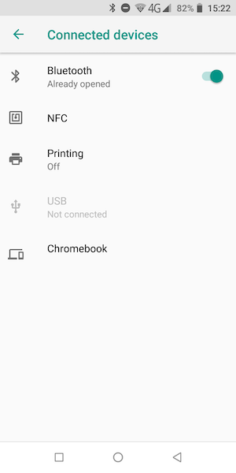

## Bluetooth control

To remotely pilot your robot, you're going to use the Blue Dot library.
This will let you control the robot from an Android phone or tablet.

### Pairing your Raspberry Pi with your Android device

Later on, you will need to login to your Raspberry Pi to enable the pairing via the command line. Therefore it makes sense to use that method rather than using the Desktop.

On your Raspberry Pi:

Open a Terminal window.

Type `bluetoothctl` and press Enter to open Bluetooth control

At the [bluetooth]# prompt enter the following commands:

discoverable on
pairable on
default-agent

Depending on the version of Android you are running, the steps to follow on your device may vary slightly but should be close to:

Open Settings
Select Connected Devices



Turn Bluetooth on and select the Bluetooth menu
Select Pair new device


Your Raspberry Pi will appear in the list; select it
Enter a PIN


On your Raspberry Pi:

Enter the same PIN
Type quit and press Enter to return to the command line

### Testing Bluedot

Now test that Blue Dot.

Create a new Python file on your Raspberry Pi called bluedot_test.py:

```python
from bluedot import BlueDot
bd = BlueDot()
print('Waiting...')
bd.wait_for_press()
print("It worked!")
```
Run this program and then grab your Android phone or tablet and  open the app on that device. The first screen will show you a list of Bluetooth devices that have been paired with your device.


Click on the 'raspberrypi' entry.

You should then see a big blue dot on your screen. Tap the dot.

Back on the Raspberry Pi you should see that your program has accepted the Bluetooth connection and successfully responded to you pressing the blue dot.  


### Integrating your motor code with Blue Dot

Now modify your code from the previous step so that the movement sequence is triggered by a press of the blue dot.

--- hints ---


--- hint ---

You don't need to make any changes to the function you wrote before. That's the cool thing about making your code modular with functions.


--- /hint ---

--- hint ---

The `bd.wait_for_press()` function will pause the execution of your program until it receives a message via Bluetooth to say the button has been pressed.


--- /hint ---
```python
from bluedot import BlueDot
bd = BlueDot()
from buildhat import Motor
from time import sleep

motor_l = motor('A')
motor_r = motor('B')

def stop():
  motor_l.stop()
  motor_r.stop()

def forward():
  motor_l.start(50)
  motor_r.start(-50)

def back():
  motor_l.start(-50)
  motor_r.start(50)

def left():
  motor_l.start(50)
  motor_r.start(50)

def right():
  motor_l.start(-50)
  motor_r.start(-50)

print('Waiting...')
bd.wait_for_press()
print("It worked!")
forward()
sleep(1)
stop()
sleep(1)

```

--- /hint ---

--- /hints ---

### More than just a blue dot

The Blue Dot app is more than just a simple button. The blue dot itself can also be used as a joystick when the middle, top, bottom, left or right areas of the dot are touched. You can use this to steer the robot using the blue dot.

Modify your existing code to move the robot backwards and forwards using the blue dot. Add the following new function:


```python
def move(pos):
    if pos.top:
        forward()
    elif pos.bottom:
        back()

```


```python
from bluedot import BlueDot
from signal import pause

bd = BlueDot()

def move(pos):
    if pos.top:
        robot.forward()
    elif pos.bottom:
        robot.backward()
    elif pos.left:
        robot.left()
    elif pos.right:
        robot.right()

def stop():
    robot.stop()

bd.when_pressed = move
bd.when_moved = move
bd.when_released = stop

pause()
```

You can change the robot to use variable speeds, so the further towards the edge you press the Blue Dot, the faster the robot will go.

The distance attribute returns how far from the centre the Blue Dot was pressed, which can be passed to the robot’s functions to change its speed:
