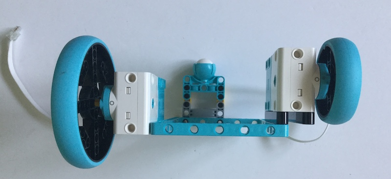

## Assembling your robot

Now you have the motor code working, it is time to construct and test your robot.

The basic design needs to fulfil  4 main requirements:

Two motors mounted parallel to each other.
Two wheels.
Some kind of caster or balance point at the front.
A way of supporting the Raspberry Pi and battery pack.

[[[attach_rpi_to_lego]]]

The robot shown in the images below uses components from the LEGO Education Spike Prime kit.


Use whatever LEGO elements you have construct the robot. Try to be adaptable and work with what you've got available.

For example, how could you adapt your code to cope if you only have wheels of different diameters?



--- hints ---

--- hint ---

The speed of the motors would need to be adjusted to compensate for the fact that a
single rotation of the bigger wheel would move the robot further than the smaller wheels.

--- /hint ---

--- hint ---

The ratio of speeds should be the same as the ratio of diameters (because the circumferences will
likewise be in the same ratio).

--- /hint ---


--- hint ---

So if the ratio of the wheel diameters was 2:1 , you should adjust the motors speeds like this:

```python
def back(speed):
  mySPIKE.SendCommand("hub.port.B.motor.run_at_speed(speed/2)")
  mySPIKE.SendCommand("hub.port.A.motor.run_at_speed(speed)")

```

--- /hint ---

--- /hints ---

### Testing

Once you robot is assembled, you should test it carefully with a monitor, keyboard and mouse connected.

When you've checked that everything works as expected, you can unleash the mobile capability of your robot by configuring it to run headless (this is what it is called when your Raspberry Pi does not have a monitor connected).  Before we can do this, we need to make a few changes to the setup of our Raspberry Pi.

First of all, make sure your Raspberry Pi is [connected to a wifi network](https://www.raspberrypi.org/documentation/configuration/wireless/desktop.md).

Then make the necessary changes to allow remote access to the Raspberry Pi from the network using either ssh (recommended) or VNC.
nix-bash-crontab

[[[rpi-vnc-access]]]

[[[rpi-ssh-access]]]


Experiment with lots of different designs to see which works best.  
You create some tests to see how the design of the robot affects performance.

Timed straight line drag race to test speeds
Twisty obstacle course to test manoeuvrability  
