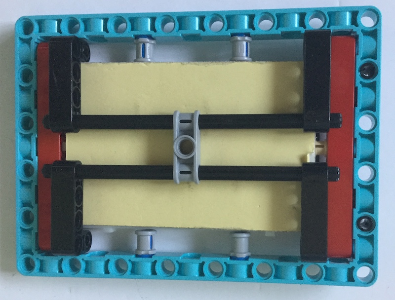
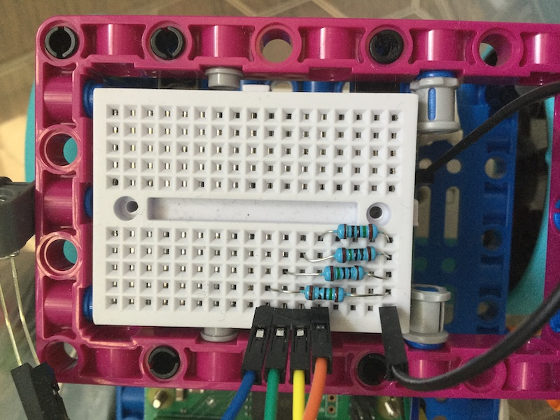

## Adding some LERDs

The holes in LEGO elements are just the right size for holding small LEDs so you can easily add them to your project with a breadboard.

There are plenty of ways of mounting a breadboard using LEGO. A couple of ideas are shown below but you can use whatever elements you have available to  






Then connect an LED to your Raspberry Pi

[[[rpi-connect-led]]]

Mow move the wire connected to the LEDs positive leg onto a numbered GPIO pin. You can choose any one you like, but this project will assume you've used pin 17.

[[[rpi-gpio-pins]]]

Now you can control the LED with Python using the GPIO Zero library which will allow you to turn on an LED by change the state of the GPIO pin to which it is connected.

Create new python program called led_test.py:

```python
from gpiozero import LED
from time import sleep

led = LED(17)

while True:
    led.on()
    sleep(1)
    led.off()
```

Run this program. You should see the LED flash on and off every second. Press the Crtl and C keys on the keyboard to stop your program.

Now add some more LEDs. Connect each one to a different GPIO pin on the Raspberry Pi. 
