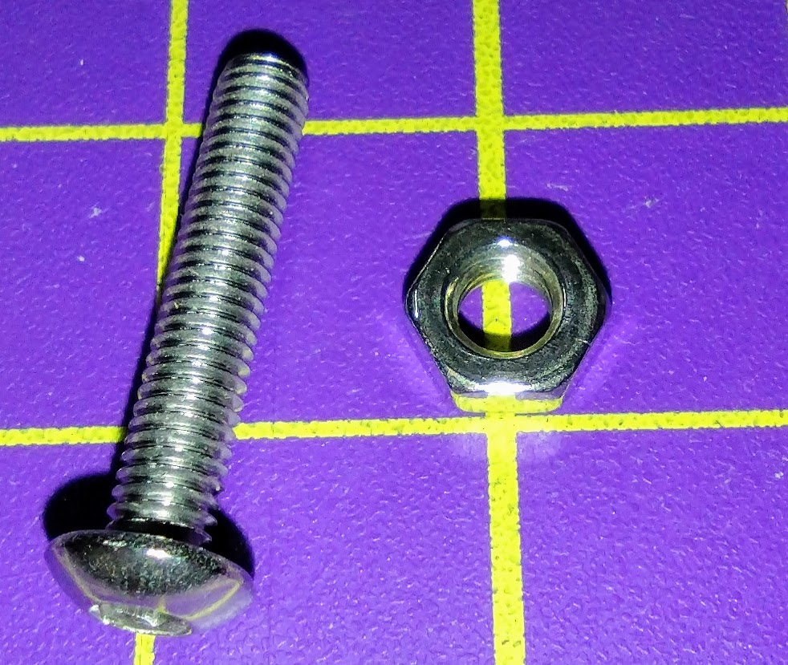
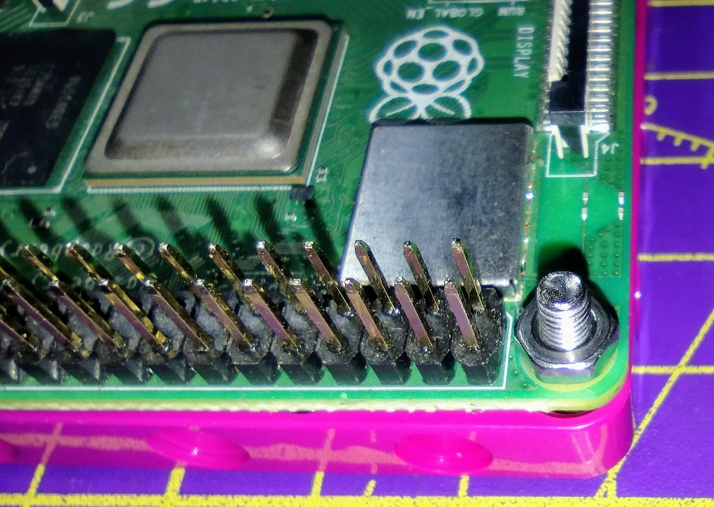
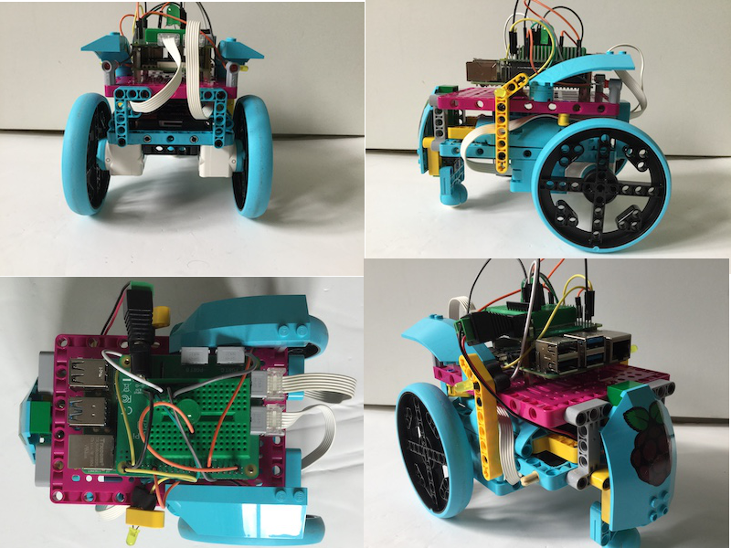
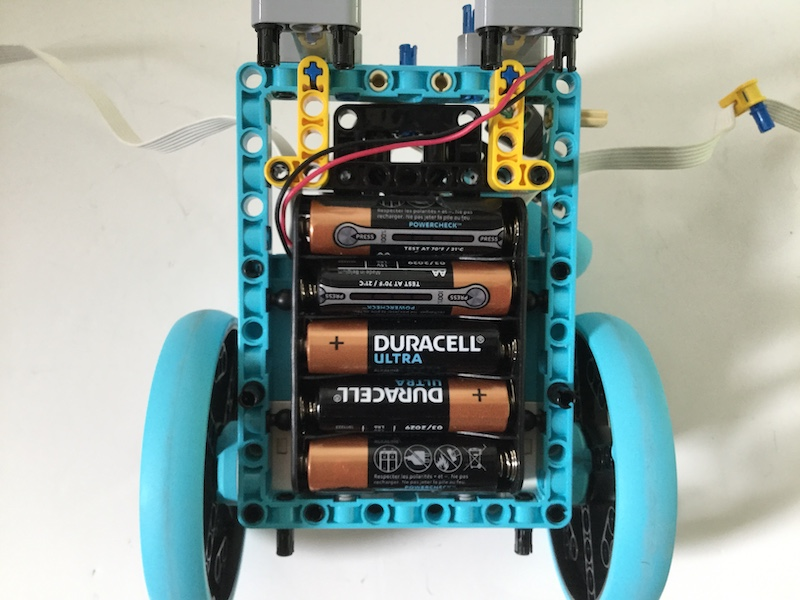

## Assembling your robot

Now you have the motor code working, it is time to construct and test your robot.

The basic design needs to fulfil 5 main requirements:

- A mounted Raspberry Pi and Build HAT.
- Two motors mounted parallel to each other.
- Two wheels.
- A caster or balance point at the front.
- A secured battery pack.

The Raspberry Pi and Build HAT can be secured to lego pieces using M2 machine screws and nuts.

[[[attach_rpi_to_lego]]]

The following photos show some different designs for how a car could be built, to incorporate a Raspberry Pi, Build HAT and battery pack.

Use whatever LEGO elements you have to construct the robot and us your imagination.

### Testing

Once you robot is assembled, you should test it carefully with a monitor, keyboard and mouse connected.

When you've checked that everything works as expected, you can unleash the mobile capability of your robot by configuring it to run headless (this is what it is called when your Raspberry Pi does not have a monitor connected).  Before we can do this, we need to make a few changes to the setup of our Raspberry Pi.

First of all, make sure your Raspberry Pi is [connected to a wifi network](https://www.raspberrypi.org/documentation/configuration/wireless/desktop.md).

Then make the necessary changes to allow remote access to the Raspberry Pi from the network using either ssh (recommended) or VNC.

[[[rpi-vnc-access]]]

[[[rpi-ssh-access]]]

Experiment with lots of different designs to see which works best.  
You create some tests to see how the design of the robot affects performance.

Timed straight line drag race to test speeds
Twisty obstacle course to test manoeuvrability  
