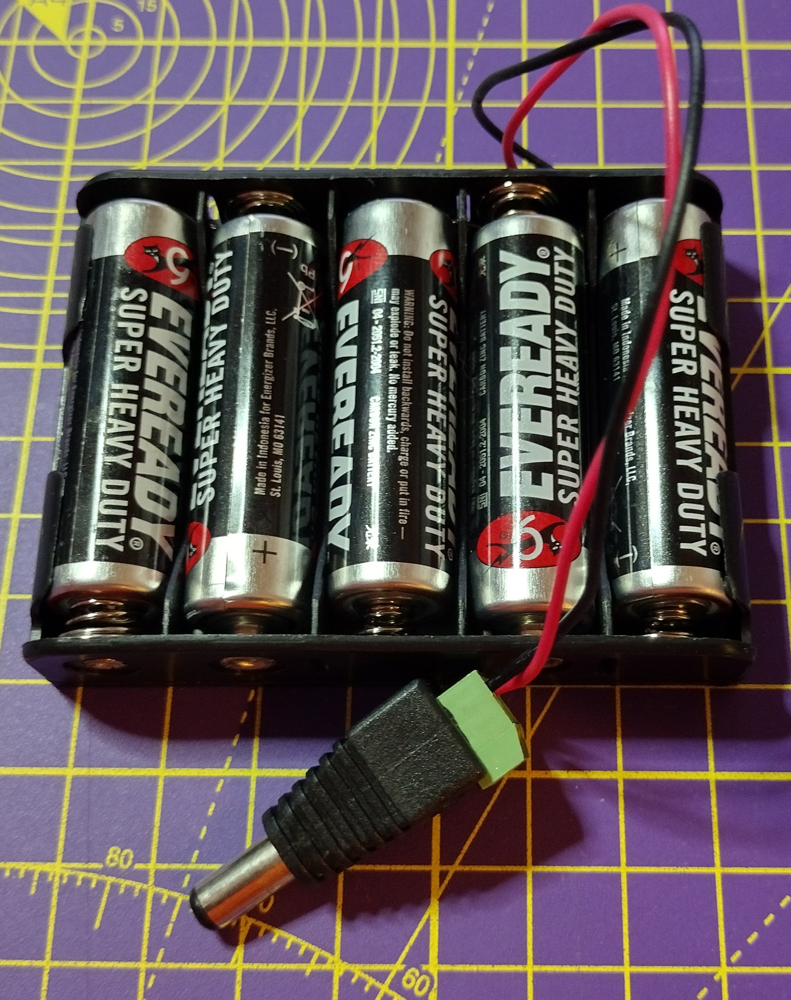
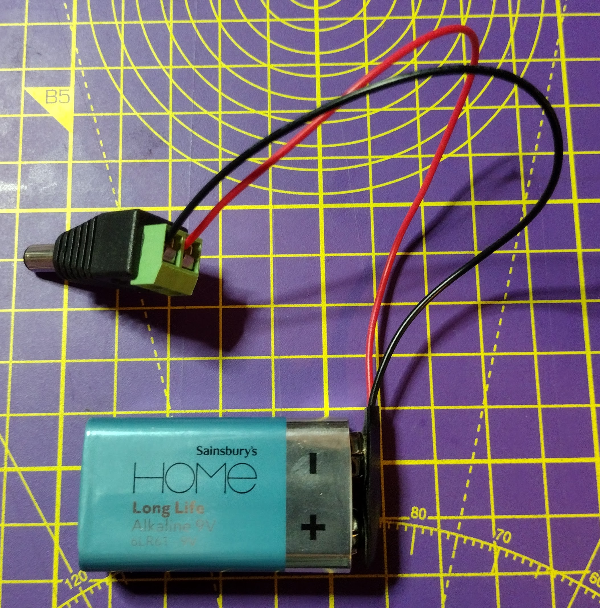

## Assembling your robot

Now you have the motor code working, it is time to construct and test your robot.

The basic design needs to fulfil 5 main requirements:

- A mounted Raspberry Pi and Build HAT.
- Two motors mounted parallel to each other.
- Two wheels.
- A caster or balance point at the front.
- A secured battery pack with barrel connector.

The Raspberry Pi and Build HAT can be secured to lego pieces using M2 machine screws and nuts.


[[[attach_rpi_to_lego]]]

You can power the Raspberry Pi and Build HAT using a battery connected to a barrel jack. A minimum of 5 AA batteries or a 9V battery will be required.





The following photos show some different designs for how a car could be built, to incorporate a Raspberry Pi, Build HAT and battery pack.


--- task ---

Use whatever LEGO elements you have to construct the robot and use your imagination.

--- /task ---

### Testing

Once you robot is assembled, you should test it using Bluetooth with you Android device.

--- task ---

Power your Raspberry Pi, and then run your `bt_car.py` program. Test that you car works when using Bluetooth and the Blue Dot app from your Android device.

--- /task ---

You may need to make changes to your code, depending on which side your of the car, and which way around your motors are connected.

Next you need to make you Raspberry Pi run **headless**. This means running your code without needing to have a monitor, keyboard or mouse connected.

First of all, make sure your Raspberry Pi is [connected to a wifi network](https://www.raspberrypi.org/documentation/configuration/wireless/desktop.md).

Now you can use a program called **cron** to make your Python script run everytime the Raspberry Pi is booted.

--- task ---

Open a terminal by pressing **Ctrl** + **Alt** + **T** on your keyboard.

--- /task ---

--- task ---

Type `crontab -e` into the terminal window. If this is the first time you have ever used **crontab** then it will ask you which editor you would like to use.

```bash
pi@raspberrypi:~ $ crontab -e
no crontab for pi - using an empty one

Select an editor.  To change later, run 'select-editor'.
  1. /bin/nano        <---- easiest
  2. /usr/bin/vim.tiny
  3. /bin/ed

Choose 1-3 [1]: 
```

Unless you are experienced with **vim** choose `1. /bin/nano`

--- /task ---

Nano will open up and show the default template file.

--- task ---

Use the cursor keys to scroll to the bottom of the file. You can then add this single line, which will wait for 30 seconds and then run your `bt_car.py` file.

```bash
# m h  dom mon dow   command
@reboot sleep 30 && python3 /home/pi/bt_car.py
```

--- /task ---

--- task ---

Reboot your Raspberry Pi, wait for 30 seconds and then use your Blue Dot app on your Android device to connect to your car and control it.

--- /task ---


