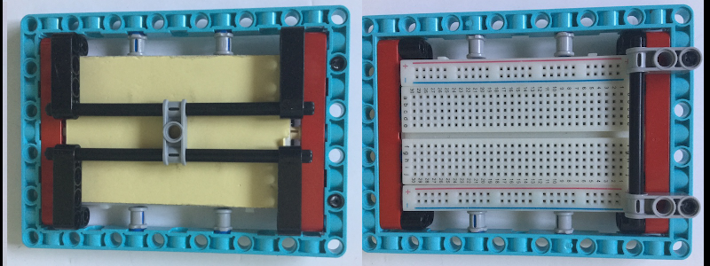

## Adding some LEDs

The holes in LEGO elements are just the right size for holding small LEDs so you can easily add them to your project with a breadboard.

There are plenty of ways of mounting a breadboard using LEGO. A couple of ideas are shown below but you can use whatever elements you have available to you.



You could use a small breadboard and sit it in the space on top of your HAT. Many breadboards have an adhesive strip on the bottom that you could use to stick firmly onto the HAT, but note that this will partially cover the slit which is used for the camera cable if you wish to add a [Raspberry Pi camera](https://projects.raspberrypi.org/en/projects/getting-started-with-picamera) to your project.


Once you've got your breadboard stable,  connect an LED to your Raspberry Pi

[[[rpi-connect-led]]]

Mow move the wire connected to the LEDs positive leg onto a numbered GPIO pin. You can choose any one you like, but this project will assume you've used pin 17.

[[[rpi-gpio-pins]]]

Now you can control the LED with Python using the GPIO Zero library which will allow you to turn on an LED by change the state of the GPIO pin to which it is connected.

Create new python program called led_test.py:

```python
from gpiozero import LED
from time import sleep

led = LED(17)

while True:
    led.on()
    sleep(1)
    led.off()
```

Run this program. You should see the LED flash on and off every second. Press the Crtl and C keys on the keyboard to stop your program.

Now add some more LEDs. Connect each one to a different GPIO pin on the Raspberry Pi. Add some extra code to the program above so the news LEDs can be controlled too. There are plots of ways to control LEDs with Python and GPIO Zero. For example, you could use LedBoard:

```python
from gpiozero import LEDBoard
from time import sleep

leds = LEDBoard(5, 6, 13, 17, 19)

leds.on()
sleep(1)
leds.off()
sleep(1)
leds.value = (1, 0, 1, 0, 1)
sleep(1)
leds.blink()

```
In this case, there are 5 LEDs, connected to GPIO pins 5,6,13,17 and 19.

Once you've got all the circuits working, add some extra jumper leads to extend the reach of the LEDs.


Then insert the LED into the LEGO element of your choice. If you find that the legs of the LEDs are coming close together or touching, you can insulate one with some tape to prevent short-circuiting.


Add the breadboard assembly and LEDs to a suitable place on your model.

Now integrate your LED code with the Blue Dot robot program. 

### Other enhancements

Buzzers
