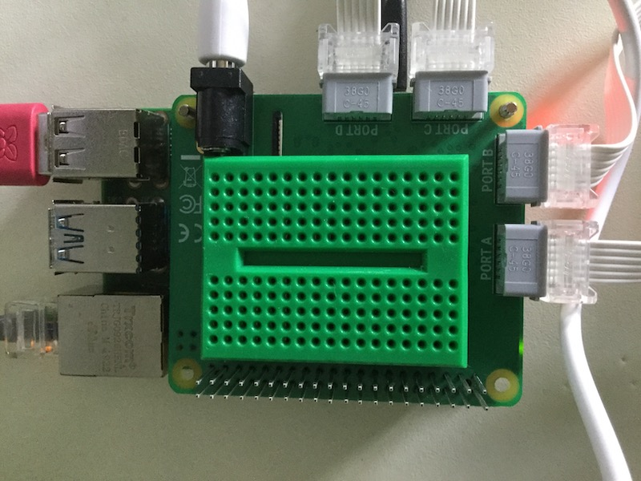

## Adding some LEDs

The holes in LEGO elements are just the right size for holding small LEDs so you can easily add them to your project or use a breadboard.

There are plenty of ways of mounting a breadboard using LEGO. A couple of ideas are shown below but you can use whatever elements you have available to you.

You could use a small breadboard and sit it in the space on top of your HAT. Many breadboards have an adhesive strip on the bottom that you could use to stick firmly onto the HAT, but note that this will partially cover the slit which is used for the camera cable if you wish to add a [Raspberry Pi camera](https://projects.raspberrypi.org/en/projects/getting-started-with-picamera) to your project.

--- task ---

Use your breadboard to connect two or more LEDs to your Raspberry Pi. In the example below pins 20 and 21 are used on the Raspberry Pi.

--- /task ---

[[[rpi-gpio-pins]]]

[[[rpi-connect-led]]]

If needed you can add some extra jumper leads to extend the reach of the LEDs.

Additionally the LEDs can be inserted into the LEGO element of your choice. If you find that the legs of the LEDs are coming close together or touching, you can insulate one with some tape to prevent short-circuiting.

--- task ---

Alter your code to import the `LED` object from `gpiozero` and set up the LEDs.

--- code ---
---
language: python
filename: bt_car.py
line_numbers: true
line_number_start: 
line_highlights: 4, 9, 10
---
from buildhat import Motor
from bluedot import BlueDot
from signal import pause
from gpiozero import LED

motor_left = Motor('A')
motor_right = Motor('B')
bd = BlueDot()
led_left = LED(20)
led_right = LED(21)
--- /code ---

--- /task ---

--- task ---

Alter your code so that the LEDs light, dependent on the movement of the car. In the example below, both LEDs light when the car moves backwards or stops. They turn off when the car moves forwards. The left LED will blink when the car moves left and the right LED will blink when the car moves right.

--- code ---
---
language: python
filename: bt_car.py
line_numbers: true
line_number_start: 13
line_highlights: 16, 17, 23, 24, 30, 31, 37, 38, 44, 45
---
def stop():
    motor_left.stop()
    motor_right.stop()
    led_right.on()
    led_left.on()

def forward():
    motor_left.start(-100)
    motor_right.start(100)
    led_right.off()
    led_left.off()

def backward():
    motor_left.start(100)
    motor_right.start(-100)
    led_right.on(0.2)
    led_left.on(0.2)

def right():
    motor_left.start(-100)
    motor_right.start(-100)
    led_right.blink(0.2)
    led_left.off()

def left():
    motor_left.start(100)
    motor_right.start(100)
    led_right.off()
    led_left.blink(0.2)
--- /code ---

--- /task ---

You can use your imagination to light or blink the LEDs in anyway you want.

--- save ---