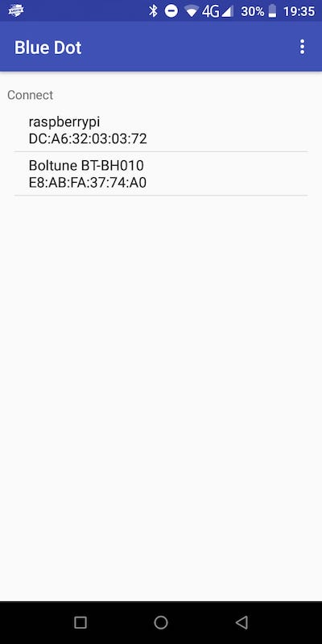

## Configura y pruebe el control de Bluetooth

Para manejar tu carro desde lejos, utilizarás la biblioteca y la aplicación de Android Blue Dot. Solo deberías tener que sincronizar tu raspberry pi y tu dispositivo móvil una vez. Después de eso, deberían conectarse fácilmente cada vez.

--- collapse ---
---
title: Instala la biblioteca Blue Dot de Python
---

--- task ---

Abre una ventana de terminal. En la entrada de comandos escribe
```
sudo pip3 install bluedot
```
y presiona <kbd>Entrar</kbd>.

--- /task ---

Deberías ver que la terminal contesta que la última versión de Blue Dot está instalada.

--- /collapse ---

### Sincronizando tu Raspberry Pi con tu dispositivo Android

--- task ---

Haz clic en el ícono de Bluetooth en la esquina superior derecha del escritorio y asegúrate de que Bluetooth esté en **Encendido** y que el dispositivo sea **Detectable**.


--- /task ---

Dependiendo de la versión de Android que tengas, los pasos a seguir en tu dispositivo pueden variar un poco, pero deberían parecerse a:

--- task ---

En **Configuración**, busca la configuración de Bluetooth y luego **Dispositivos conectados**.


--- /task ---

--- task ---

Elije **Sincronizar nuevo dispositivo** y luego selecciona tu Raspberry Pi entre los dispositivos que se muestran.


Luego elije **Sincronizar** en el cuadro de diálogo.


--- /task ---

--- task ---

En la Raspberry Pi, vas a ver un mensaje pidiendo que aceptes la solicitud de sincronización.


Al hacer clic en **Aceptar** debería mostrar una sincronización exitosa entre Raspberry Pi el dispositivos Android.


--- /task ---

A veces, es posible que te pida que confirmes un código antes de permitirte sincronizar los dispositivos.


### Prueba de Blue Dot

--- task ---

Crea un nuevo archivo Python en tu Raspberry Pi con el siguiente código y llámalo bluedot_test.py.

--- code ---
---
language: python 
filename: bluedot_test.py 
line_numbers: true 
line_number_start:
line_highlights:
---

from bluedot import BlueDot   
punto = BlueDot()

print('Esperando...')   
punto.wait_for_press()    
print("¡Funcionó!")

--- /code ---

--- /task ---

--- task ---

Ejecuta el programa y luego, en tu dispositivo Android, abre la aplicación [Blue Dot](https://play.google.com/store/apps/details?id=com.stuffaboutcode.bluedot&hl=en_GB&gl=US). La primera pantalla te mostrará una lista de dispositivos Bluetooth que se han sincronizado con tu dispositivo.



--- /task ---

--- task ---

Haz clic en **raspberrypi** en el menú y deberías ver un gran punto azul en la pantalla. Toca el punto.


--- collapse ---
---
title: Bluedot no selecciona mi Raspberry Pi
---

 Para que BlueDot se conecte a tu Raspberry Pi, es necesario que se esté ejecutando un servidor en la Raspberry Pi. Esto significa que un objeto BlueDot (`punto = BlueDot ()`) tiene que haberse creado en tu programa Python y tiene que estar esperando conexiones.

 Asegúrate de que estás ejecutando tu programa antes de intentar conectarte con Bluedot y que no tenga errores.

--- /collapse ---

--- /task ---

--- task ---

En la Raspberry Pi, deberías ver que tu programa ha aceptado la conexión Bluetooth y que ha respondido con éxito cuando presionas el punto azul.


--- /task ---
