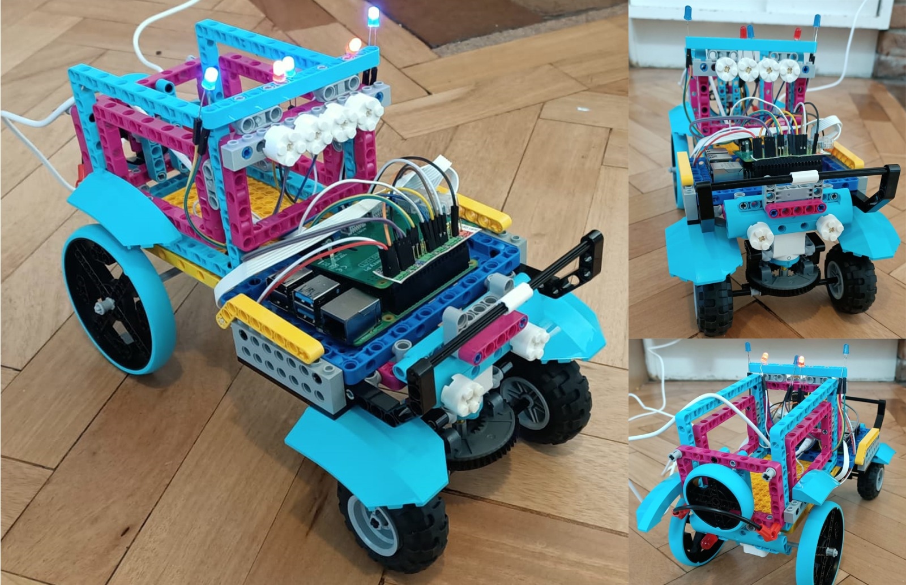

## Armando tu robot

Ahora que el código del motor funciona, es hora de construir y probar tu robot.

El diseño básico debe cumplir cinco requisitos principales:

- Una Raspberry Pi con Build HAT instalado
- Dos motores montados en paralelo entre sí
- Dos ruedas
- Una rueda libre o un punto de equilibrio en la parte delantera
- Un paquete de baterías con conector de barril asegurado al chasis

La Raspberry Pi y Build HAT se pueden fijar a las piezas LEGO® mediante el uso de tuercas y tornillos M2.


[[[attach_rpi_to_lego]]]

Puedes alimentar la Raspberry Pi y Build HAT con una batería conectada a un conector de barril. Se requiere un mínimo de cinco baterías AA o una batería de 9V.


Las siguientes fotos muestran algunos diseños diferentes de cómo se podría construir tu carro LEGO®, que incorporan la Raspberry Pi, Build HAT y el paquete de baterías.




--- task ---

Usa los elementos LEGO® que tengas para construir el robot y usa tu imaginación.

--- /task ---

### Pruebas

Una vez que tu robot esté ensamblado, debes probarlo usando Bluetooth con tu dispositivo Android.

--- task ---

Enciende su Raspberry Pi y luego ejecuta tu programa `bt_car.py`. Comprueba que su automóvil funciona cuando usas Bluetooth y la aplicación Blue Dot desde tu dispositivo Android.

--- /task ---

Es posible que debas hacer cambios en tu código, dependiendo de qué lado del automóvil y en qué dirección están conectados tus motores.

A continuación, debes hacer que tu Raspberry Pi funcione **sin cabeza**. Esto significa ejecutar tu código sin necesidad de tener un monitor, teclado o mouse conectados.

En primer lugar, asegúrate de que tu Raspberry Pi esté [conectada a una red WiFi](https://www.raspberrypi.org/documentation/configuration/wireless/desktop.md).

Ahora, puedes usar un programa llamado **cron** para hacer que tu programa Python se ejecute cada vez que se inicie la Raspberry Pi.

--- task ---

Abre una terminal presionando <kbd>Ctrl</kbd>+<kbd>Alt</kbd>+<kbd>T</kbd> en tu teclado.

--- /task ---

--- task ---

Escribe `crontab -e` en la ventana de la terminal. Si es la primera vez que usas **crontab**, te preguntará qué editor te gustaría usar.

```bash
pi@raspberrypi:~ $ crontab -e
no crontab for pi - using an empty one

Selecciona un editor. Para cambiar esto más tarde, ejecuta 'select-editor'.
  1. / bin / nano        <---- más fácil
  2. /usr/bin/vim.tiny
  3. /bin /ed

Elije 1-3 [1]: 
```

A menos que tengas experiencia con **vim**, elije `1. /bin/nano`.

--- /task ---

Nano se abrirá y mostrará el archivo de plantilla por defecto.

--- task ---

Utiliza las teclas del cursor para desplazarte hasta el final del archivo. Agrega esta línea, que esperará 30 segundos y luego ejecutará tu archivo `bt_car.py`.

```bash
# m h  dom mon dow   command
@reboot sleep 30 && python3 /home/pi/bt_car.py
```

--- /task ---

--- task ---

Reinicia tu Raspberry Pi, espera 30 segundos y luego usa tu aplicación Blue Dot en tu dispositivo Android para conectarte a tu automóvil y controlarlo.

--- /task ---


