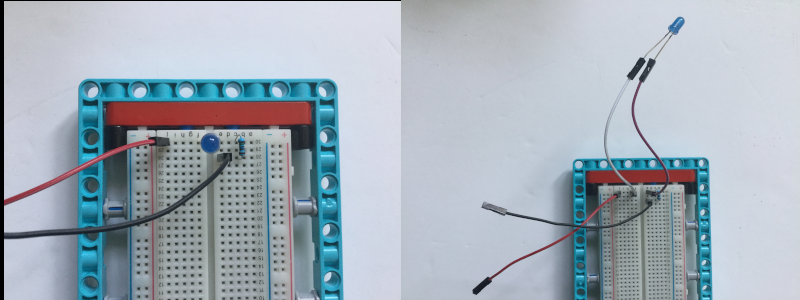

## Añadiendo algunos LEDs

Los orificios de los elementos LEGO® tienen el tamaño perfecto para contener LEDs pequeños, por lo que puedes agregarlos fácilmente a tu proyecto. Alternativamente, puedes usar una placa de pruebas.

Hay muchas formas de montar una placa de pruebas con LEGO®. A continuación se muestran un par de ideas, pero puedes utilizar los elementos que tengas disponibles.

Puedes usar una pequeña placa de pruebas y colocarla en el espacio encima de su HAT. Muchas placas de prueba tienen una tira adhesiva en la parte inferior que puedes usar para pegarla firmemente en el HAT, pero ten en cuenta que esto cubrirá parcialmente la hendidura que se usa para el cable de la cámara si deseas agregar una [cámara Raspberry Pi](https://projects.raspberrypi.org/es-ES/projects/getting-started-with-picamera) a tu proyecto.

--- task ---

Use su placa de pruebas para conectar dos o más LEDs a tu Raspberry Pi. En el siguiente ejemplo, se utilizan los pines 20 y 21 de la Raspberry Pi.

--- /task ---

[[[rpi-gpio-pins]]]

[[[rpi-connect-led]]]

Si es necesario, puedes agregar algunos cables de puente adicionales para extender el alcance de los LEDs.

Además, los LEDs se pueden insertar en el elemento LEGO® de tu elección. Si encuentras que las patas de los LEDs están demasiado juntas o se tocan puedes aislar una con cinta para evitar cortocircuitos.

--- task ---

Modifica tu código para importar el objeto `LED` de `gpiozero` y configura los LEDs.

--- code ---
---
language: python 
filename: bt_car.py 
line_numbers: true 
line_number_start:
line_highlights: 4, 9, 10
---

from buildhat import Motor    
from bluedot import BlueDot    
from signal import pause     
from gpiozero import LED

motor_izquierda = Motor('A')     
motor_derecha = Motor('B')     
punto = BlueDot()     
led_izquierda = LED(20)     
led_derecha = LED(21)

--- /code ---

--- /task ---

--- task ---

Modifica tu código para que los LEDs se enciendan, dependiendo del movimiento del automóvil. En el siguiente ejemplo, ambos LEDs se encienden cuando el automóvil se mueve hacia atrás o se detiene. Se apagan cuando el coche avanza. El LED izquierdo parpadeará cuando el automóvil se mueva hacia la izquierda y el LED derecho parpadeará cuando el automóvil se mueva hacia la derecha.

--- code ---
---
language: python 
filename: bt_car.py 
line_numbers: true 
line_number_start: 13
line_highlights: 16, 17, 23, 24, 30, 31, 37, 38, 44, 45
---

def parar():    
    motor_izquirda.stop()     
    motor_derecha.stop()    
    led_derecha.on()     
    led_izquierda.on()

def avanzar():    
    motor_izquierda.start(-100)    
    motor_derecha.start(100)    
    led_derecha.off()    
    led_izquierda.off()

def atras():    
    motor_izquierda.start(100)    
    motor_derecha.start(-100)    
    led_derecha.on(0.2)    
    led_izquierda.on(0.2)

def derecha():    
    motor_izquierda.start(-100)    
    motor_derecha.start(-100)    
    led_derecha.blink(0.2)    
    led_izquierda.off()

def izquierda():    
    motor_izquierda.start(100)    
    motor_derecha.start(100)    
    led_derecha.off()     
    led_izquierda.blink(0.2)

--- /code ---

--- /task ---

Puedes usar tu imaginación para encender o hacer parpadear los LEDs de la forma que desees.

--- save ---
