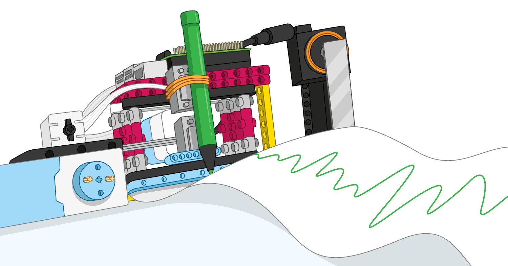

## ¿Qué sigue?

Si deseas mejorar su automóvil Bluetooth, podrías pensar en agregar más componentes electrónicos:

+ Agrega LEDs adicionales como luces intermitentes de "persecución" de la policía o faros delanteros cuando el automóvil marcha

+ Muchos vehículos emiten un sonido cuando están dando marcha atrás, por lo que podrías agregar un zumbator a tu proyecto

+ ¡Incluso podrías usar un sensor de distancia ultrasónico (UDS), que detecta cuando el automóvil se acerca a un obstáculo y evita que choque automáticamente!

Si está siguiendo la [Introducción a LEGO BuildHAT](https://projects.raspberrypi.org/en/pathways/lego-intro), puedes pasar al proyecto [Trazador LEGO](https://projects.raspberrypi.org/en/projects/lego-plotter). ¡En este proyecto, harás un trazador que dibuja en papel!

