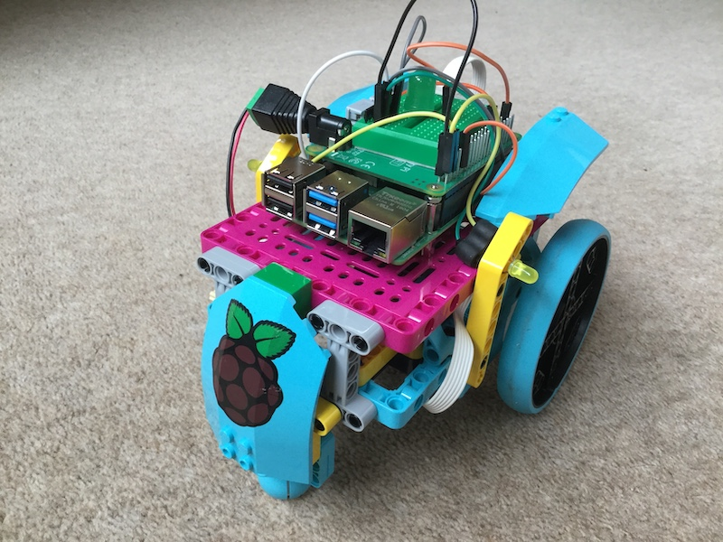
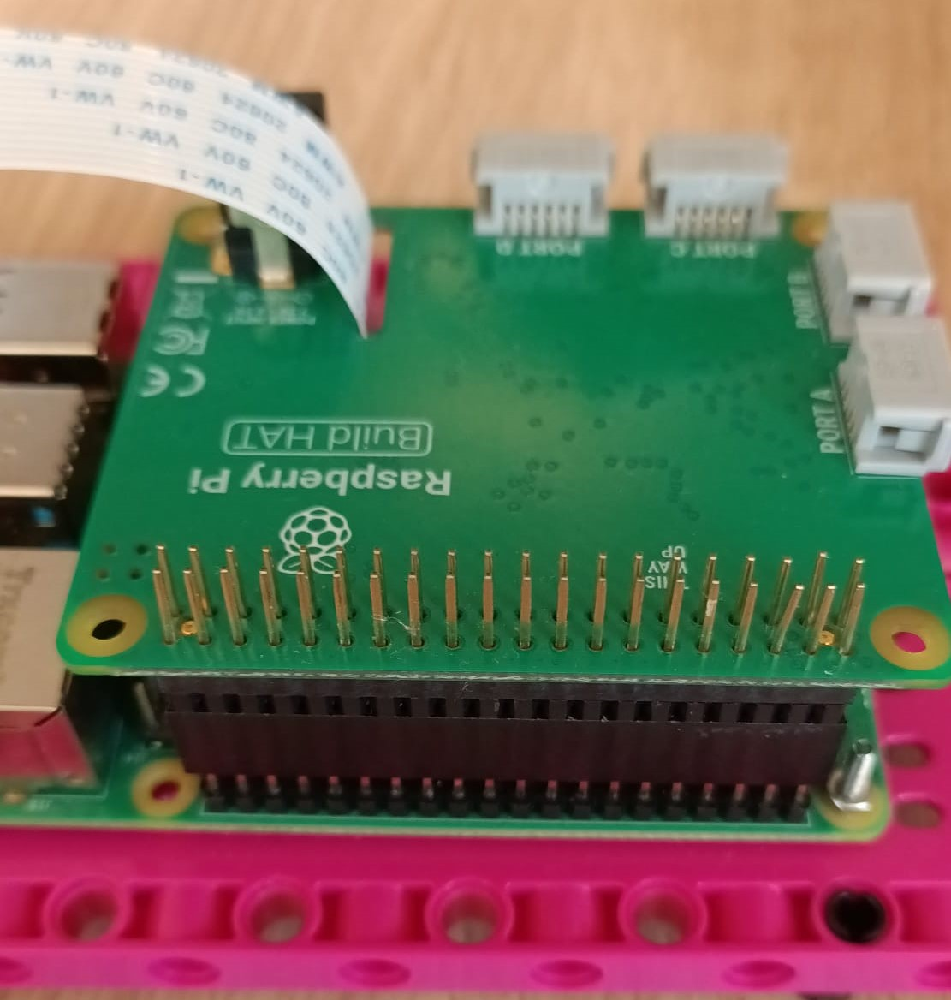

## はじめに

LEGO® と Raspberry Pi Build HAT を使用してロボットカーを作成し、 Android フォンから Bluetooth 接続で制御できるようにプログラムを作成します。 そして、いくつかのLEDを追加して、車を輝かせましょう。

[Bluetooth](https://ja.wikipedia.org/wiki/Bluetooth)という名前 は、1997年にIntelのJim Kardachによって提案されました。 この提案が提出された頃、彼はフランス・G・ベントソンがバイキングと10世紀のデンマーク王ハーラル1世青歯王について書いた歴史小説 *The Long Ships* を読んでいました。 Bluetooth (青歯王) はハーラル王のニックネームであり、彼がデンマークの部族を一つの王国に統一したように、Bluetoothは通信プロトコルを統合しました。

本項で学ぶこと:
+ Raspberry Pi BuildHATを使用してLEGO® Technic™ モーターを制御します
+ Bluetoothを使用してRaspberryPiに信号を送信します
+ Raspberry Piでgpiozeroを使用して、LEDを制御する方法を学びます

--- no-print ---

--- /no-print ---

今回は車輪付きの車を作ります。 動作は、車の両側に配置された独立した駆動系をもつ車輪の動きによって決まり、前進・後進・回転の動きができるようにします。 オプションで、ブレーキライト、インジケーター、またはヘッドライト用のLEDを車に追加できます。

--- print-only ---

--- /print-only ---

### 必要なもの

+ 最新のデスクトップバージョンの Raspberry Pi OS が起動する Raspberry Pi コンピューター
+ Raspberry Pi Build HAT
+ 2つの LEGO® Technic™ モーター
+ ホイール2つを含む LEGO® 製品 (本項では [LEGO® エデュケーション SPIKE™ プライムセット](https://education.lego.com/en-gb/product/spike-prime) を使用することを前提とします)
+ Android の携帯電話またはタブレット
+ 5本の単3電池とバレルジャック付き電池ケース

### ソフトウェア

+ Build HAT を制御するための Build HAT Python ライブラリ
+ Blue Dot Pythonライブラリと Blue Dot Android アプリ
+ gpiozero Python ライブラリ

--- collapse ---
---
title: 教育者向けの追加情報
---

完全なプロジェクトは [こちら](https://rpf.io/p/ja-JP/bt-robot-car-go)からダウンロードできます。

このプロジェクトを印刷する必要がある場合は、 [印刷用バージョン](https://projects.raspberrypi.org/ja-JP/projects/bt-robot-car/print){:target="_ blank"}を使用してください。

--- /collapse ---

開始する前に、Raspberry Piのセットアップと、Build HATの装着をしてください:

--- task ---

M2のボルトとナットを使用して、 LEGO ビルドプレートの上にRaspberry Piを取り付けます。 Raspberry Piはふちがない方の面に載せます:

 

--- /task ---

写真のとおりにRaspberry Piを固定することで、SDカードスロットが扱いやすくなります。 ビルドプレートを使うことで、 ダッシュボードのおもな構造に、より簡単に Raspberry Pi を接続できます。

--- task ---

`This way up` の文字が見えるようにBuild HATをRaspberry Piと並べます。 全部のGPIOピンがHATにかぶるよう合わせて、しっかり押し下げてください。 (例では、ピンが長くなる [スタッキングヘッダー](https://www.adafruit.com/product/2223){:target="_blank"} を使用しています。)

 

--- /task ---

モーターを使用するためには、Build HAT上のバレルジャックに7.5Vの電源を接続してRaspberry Piに電源を供給する必要があります。

--- task ---

まだRaspberry Piのセットアップが済んでいない場合は、次の手順に従ってセットアップしてください:

[Raspberry Piのセットアップ](https://projects.raspberrypi.org/ja-JP/projects/raspberry-pi-setting-up){:target="_blank"}

--- /task ---

--- task ---

Raspberry Piが起動したら、Raspberry Piメニューをクリックして“Preferences”と “Raspberry Pi Configuration”の順に選択して、Raspberry Pi Configuration toolを起動します。

“interfaces”タブをクリックして、シリアルの設定を以下のとおりに設定します:

--- /task ---

--- task ---

また、以下の手順に従って、buildhat pythonライブラリのインストールも必要になります。

--- collapse ---
---
title: buildhat Python ライブラリのインストール
---

<kbd>Ctrl</kbd>+<kbd>Alt</kbd>+<kbd>T</kbd> を押して、Raspberry Pi上でターミナルウィンドウを開きます。

プロンプトで次の通りに入力します: `sudo pip3 install buildhat`

<kbd>Enter</kbd> キーを入力して "installation completed" のメッセージが表示されるまで待ちます。

--- /collapse ---

--- /task ---