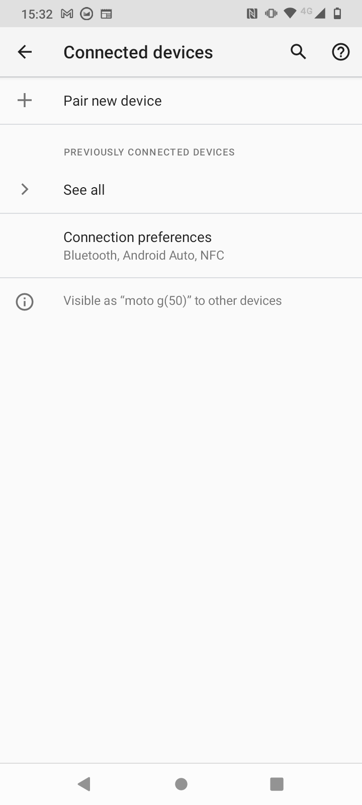
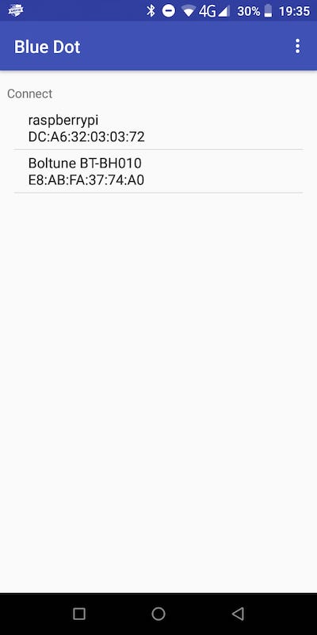
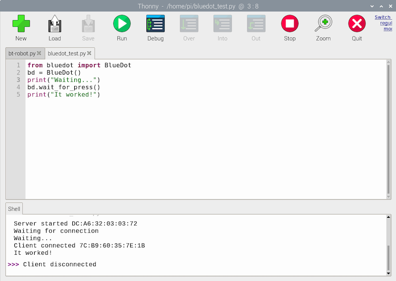

## Bluetoothのセットアップとテスト

車をリモート操作するには、 Blue Dot のライブラリと Android アプリを使います。 Raspberry Pi とモバイルデバイスをペアリングする必要があるのは1回だけです。 その後は、いつでも簡単に接続できます。

--- collapse ---
---
title: Blue Dot ライブラリのインストール
---

--- task ---

ターミナルウィンドウを開きます。 プロンプトで次の文字を入力し、
```
sudo pip3 install bluedot
```
そして <kbd>Enter</kbd> を押します。

--- /task ---

最新バージョンの Blue Dot がインストールされたことがターミナルに表示されるのを確認します。

--- /collapse ---

### Raspberry Pi を Android デバイスとペアリングする

--- task ---

デスクトップの右上の角にあるBluetoothアイコンをクリックして、Bluetoothが**オン**になっていることと、デバイスが**検出可能**になっていることを確認します。


--- /task ---

実行中のAndroidのバージョンによっては、デバイス上で行う手順が少し違う場合がありますが、次のようになります:

--- task ---

**設定**からBluetoothの設定を探して**接続済みのデバイス**を開きます。



--- /task ---

--- task ---

**新しいデバイスとペア設定する**を選択して、表示されたデバイスからRaspberry Piのデバイスを選択します。


次に、ダイアログボックスから **ペア設定する** を選択します。


--- /task ---

--- task ---

Raspberry Piでは、ペアリング要求を受け入れるように求められます。


**OK** をクリックすると、RaspberryPiとAndroidデバイスのペアリングが成功したことが示されます。


--- /task ---

たまに、デバイスのペアリングを許可する前に、コードの確認を求められる場合があります。


### Blue Dot をテストする

--- task ---

次のコードを記述した bluedot_test.py という名前の新しい Python ファイルを Raspberry Pi 上に作成します。

--- code ---
---
language: python
filename: bluedot_test.py
line_numbers: true
line_number_start: 
line_highlights: 
---

from bluedot import BlueDot   
dot = BlueDot()   

print('Waiting...')   
dot.wait_for_press()    
print("It worked!")    

--- /code ---

--- /task ---

--- task ---

プログラムを実行してから、Androidデバイスで [Blue Dot](https://play.google.com/store/apps/details?id=com.stuffaboutcode.bluedot&hl=en_GB&gl=US) アプリを開きます。 最初の画面では、デバイスとペアリングされている Bluetooth デバイスのリストが表示されます。



--- /task ---

--- task ---

メニューから **raspberrypi** をクリックすると、画面に大きな青いドットが表示されます。 ドットをタップします。


--- collapse ---
---
title: Bluedot で Raspberry Pi が選択できません
---

 Blue Dot を Raspberry Pi に接続するには、サーバーが Raspberry Pi 上で実行されている必要があります。 これは、PythonプログラムでBlue Dot オブジェクト (`dot = BlueDot()`) がすでに作成されていて、接続を待機している必要があることを意味します。

 Bluedot に接続する前に、プログラムを実行していることと、エラーがないことを確認してください。

--- /collapse ---

--- /task ---

--- task ---

Raspberry Pi 上でプログラムが Bluetooth 接続を受け入れて、青いドットを押すと正常に応答することを確認します。



--- /task ---
