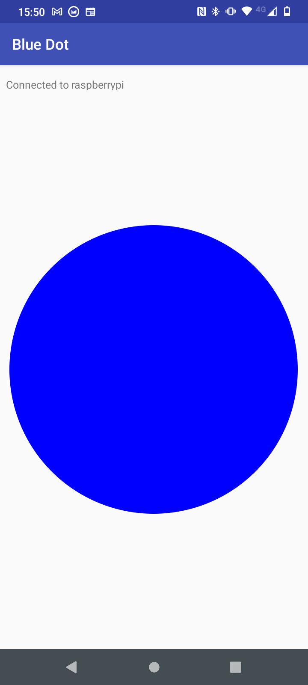

## Set up and test the Bluetooth control

To remotely pilot your car, you're going to use the Blue Dot library and Android app. You should only have to pair your raspberry pi and mobile device once. After that, they should connect easily each time.

--- collapse ---
---
title: Install the Blue Dot Python library
---

--- task ---

Open your terminal window. At the prompt type
```
sudo pip3 install bluedot
```
and press <kbd>Enter</kbd>.

--- /task ---

You should see your terminal return that the latest version of Blue Dot is installed.

--- /collapse ---

### Pairing your Raspberry Pi with your Android device

--- task ---

Click on the Bluetooth icon in the top right-hand corner of the desktop and make sure that Bluetooth is turned **On** and that the device is **Discoverable**.


--- /task ---

Depending on the version of Android you are running, the steps to follow on your device may vary slightly but should be close to:

--- task ---

In **Settings**, find your Bluetooth settings and then **Connected Devices**.


--- /task ---

--- task ---

Choose **Pair new device** and then select your Raspberry Pi device from the devices shown.


Then choose **Pair** from the dialogue box.


--- /task ---

--- task ---

On the Raspberry Pi, you should be prompted to accept the pairing request.


Clicking on **OK** should show a successful pairing of the Raspberry Pi and the Android devices.


--- /task ---

Sometimes you might be asked to confirm a code before you are allowed to pair the devices.


### Testing Blue Dot

--- task ---

Create a new Python file on your Raspberry Pi called bluedot_test.py, with the following code.

--- code ---
---
language: python filename: bluedot_test.py line_numbers: true line_number_start:
line_highlights:
---

from bluedot import BlueDot   
dot = BlueDot()

print('Waiting...')   
dot.wait_for_press()    
print("It worked!")

--- /code ---

--- /task ---

--- task ---

Run the program and then, on your Android device, open the [Blue Dot](https://play.google.com/store/apps/details?id=com.stuffaboutcode.bluedot&hl=en_GB&gl=US) app. The first screen will show you a list of Bluetooth devices that have been paired with your device.


--- /task ---

--- task ---

Click on **raspberrypi** from the menu and you should then see a big blue dot on your screen. Tap the dot.



--- collapse ---
---
title: Bluedot won't select my Raspberry Pi
---

 In order for BlueDot to connect to your Raspberry Pi, a server needs to be running on the Raspberry Pi. This means that a BlueDot object (`dot = BlueDot()`) must have already been created in your Python program and be waiting for connections.

 Make sure that you are running your program before trying to connect with Bluedot and that it has no errors.

--- /collapse ---

--- /task ---

--- task ---

On the Raspberry Pi, you should see that your program has accepted the Bluetooth connection and has successfully responded to you pressing the blue dot.


--- /task ---
