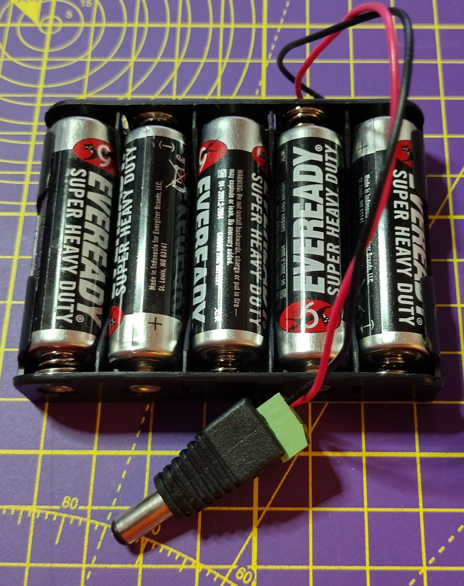

## ロボットを組み立てる

これでモーターのコードが機能するようになったので、いよいよロボットを組み立ててテストする番です。

基本設計は、5つのおもな要件を満たす必要があります。

- Raspberry Pi と Build HATが搭載されていること
- 2つのモーターが互いに平行に取り付けられていること
- 2輪であること
- キャスターかバランスポイントが前部にあること
- バレルコネクタ付きの安全な電池ボックスであること

Raspberry Pi と Build HATは、 M2 の小ネジとナットを使用して LEGO® のピースに固定できます。


[[[attach_rpi_to_lego]]]

バレルジャックに接続されたバッテリーを使用して、 Raspberry Pi と Build HAT に電力を供給できます。 最低5本の単三電池または9V電池が必要です。




次の写真は、Raspberry Pi、Build HAT、バッテリーパックを組み込んだ LEGO® カーの組み立てについて、いくつかの設計を示しています。


--- task ---

想像力を働かせ、持っている LEGO® のエレメントを駆使してロボットを組み立てましょう。

--- /task ---

### テスト

ロボットを組み立てたら、 Android デバイスで Bluetooth を使用してテストしましょう。

--- task ---

Raspberry Pi の電源を入れて、 `bt_car.py` プログラムを実行します。 Android デバイスから Bluetooth と Blue Dot アプリを使用して、車が動くことをテストします。

--- /task ---

車の向きがどちら側か、あるいはモーターがどの方向に接続されているかによっては、コードの変更が必要な場合があります。

次に、 Raspberry Pi を**ヘッドレス**で実行できるようにする必要があります。 これは、モニター、キーボードまたはマウスを接続しなくてもコードが実行できることを意味します。

まずは、 Raspberry Pi が[ WiFi ネットワークに接続されている](https://www.raspberrypi.org/documentation/configuration/wireless/desktop.md)ことを確認します。

そして、 **cron** と呼ばれるプログラムを使用して、 Raspberry Pi が起動するたびに Python スクリプトを実行できるようにします。

--- task ---

キーボードの <kbd>Ctrl</kbd>+<kbd>Alt</kbd>+<kbd>T</kbd> を押してターミナルを開きます。

--- /task ---

--- task ---

ターミナルウィンドウに `crontab -e` を入力します。 **crontab** を初めて使用する時は、使用するエディターを尋ねられます。

```bash
pi@raspberrypi:~ $ crontab -e
no crontab for pi - using an empty one

Select an editor. To change this later, run 'select-editor'.
  1. /bin/nano        <---- easiest
  2. /usr/bin/vim.tiny
  3. /bin/ed

Choose 1-3 [1]: 
```

**vim** を使ったことがなければ `1. /bin/nano` を選択してください。

--- /task ---

Nano が開き、デフォルトのテンプレートファイルが表示されます。

--- task ---

カーソルキーを使用して、ファイルの一番下までスクロールします。 次に、30秒待ってから `bt_cat.py` ファイルを実行するように、この行を追加します。

```bash
# m h  dom mon dow   command
@reboot sleep 30 && python3 /home/pi/bt_car.py
```

--- /task ---

--- task ---

Raspberry Piを再起動して、 30 秒間待ってから、 Android デバイスの Blue Dot アプリを使用し車に接続して制御します。

--- /task ---


