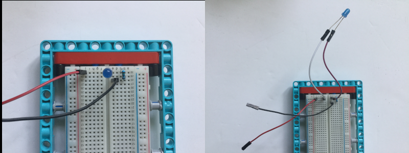

## LEDを追加する

LEGO® の穴は、小さなLEDを固定するのにちょうどいいサイズなので、プロジェクトに簡単に追加できます。 あるいは、ブレッドボードを使用することもできます。

LEGO® を使用してブレッドボードを取り付ける方法はたくさんあります。 以下にいくつかのアイデアを示しますが、使える要素は何でも使用できます。

小さなブレッドボードを使用して、 HAT の上のスペースに置くことができます。 多くのブレッドボードの裏面には、 HAT にしっかり貼り付けるために使用できる粘着テープがありますが、 [Raspberry Pi カメラ](https://projects.raspberrypi.org/en/projects/getting-started-with-picamera) をプロジェクトに追加する場合は、カメラケーブル用のスリットが部分的に覆われる点に注意してください。

--- task ---

2つ以上のLEDをRaspberry Piに接続するためにブレッドボードを使用します。 以下の例では、ピン20と21がRaspberry Piで使用されています。

--- /task ---

[[[rpi-gpio-pins]]]

[[[rpi-connect-led]]]

必要に応じてジャンパーリードを追加して、LEDまでの距離を延長できます。

さらに、LEDは好きな LEGO® エレメントに挿入できます。 LEDの脚が近すぎたり、触れ続けたりしている場合は、ショートを防ぐためにテープで絶縁することができます。

--- task ---

`LED` オブジェクトを `gpiozero` からインポートするためにコードを変更し、LEDを設定します。

--- code ---
---
language: python filename: bt_car.py line_numbers: true line_number_start:
line_highlights: 4, 9, 10
---

from buildhat import Motor    
from bluedot import BlueDot    
from signal import pause     
from gpiozero import LED

motor_left = Motor('A')     
motor_right = Motor('B')     
dot = BlueDot()     
led_left = LED(20)     
led_right = LED(21)

--- /code ---

--- /task ---

--- task ---

車の動きに応じてLEDが点灯するように、コードを変更します。 以下の例では、車が後退または停止すると、両方のLEDが点灯します。 車が前進するとオフになります。 車が左に移動すると左のLEDが点滅し、車が右に移動すると右のLEDが点滅します。

--- code ---
---
language: python filename: bt_car.py line_numbers: true line_number_start: 13
line_highlights: 16, 17, 23, 24, 30, 31, 37, 38, 44, 45
---

def stop():    
motor_left.stop()     
motor_right.stop()    
led_right.on()     
led_left.on()

def forward():    
motor_left.start(-100)    
motor_right.start(100)    
led_right.off()    
led_left.off()

def backward():    
motor_left.start(100)    
motor_right.start(-100)    
led_right.on(0.2)    
led_left.on(0.2)

def right():    
motor_left.start(-100)    
motor_right.start(-100)    
led_right.blink(0.2)    
led_left.off()

def left():    
motor_left.start(100)    
motor_right.start(100)    
led_right.off()     
led_left.blink(0.2)

--- /code ---

--- /task ---

あなたの想像力次第で、LEDを好きなように点灯または点滅させることができます。

--- save ---
