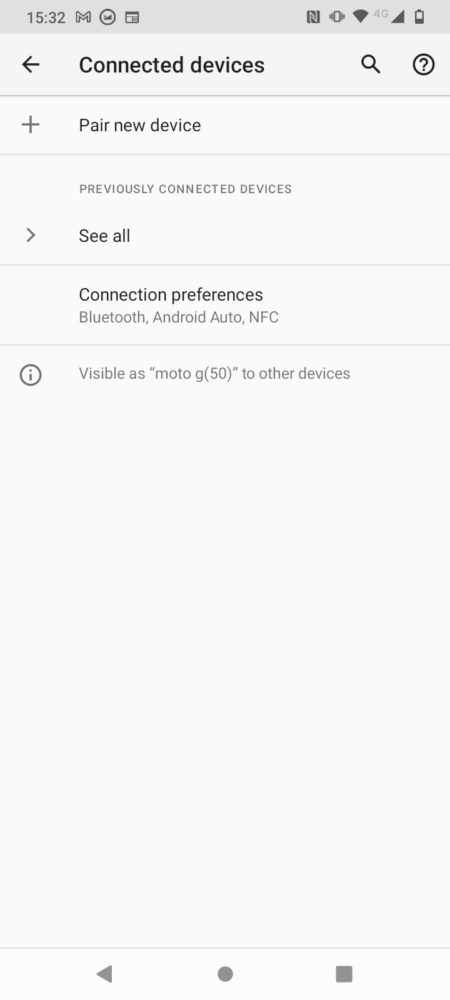
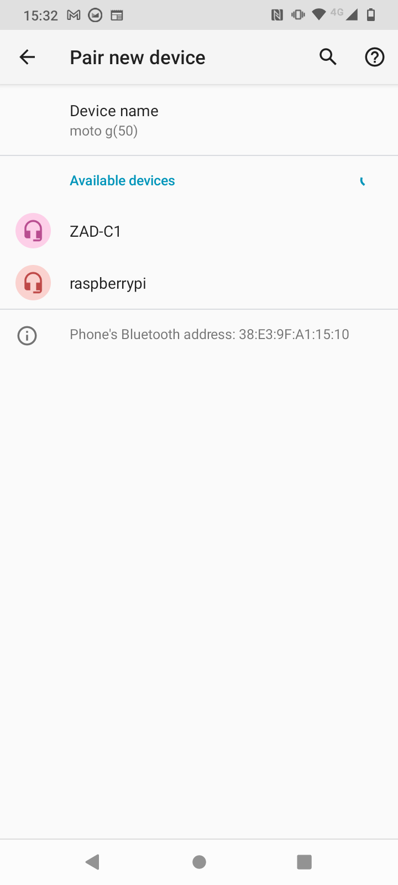
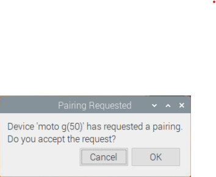

## Bluetooth 설정 및 테스트

원격으로 자동차를 조종하려면 Blue Dot 라이브러리와 Android 앱을 사용해야 합니다. You should only have to pair your raspberry pi and mobile device once. 그 후에는 쉽게 연결할 수 있습니다.

--- collapse ---
---
title: Blue Dot Python 라이브러리 설치
---

--- task ---

터미널 창을 엽니다. 프롬포트에,
```
sudo pip3 install bluedot
```
를 치고, <kbd>Enter</kbd> 를 누릅니다.

--- /task ---

터미널에서 최신 버전의 Blue Dot이 설치되었음을 꼭 확인하셔야 합니다.

--- /collapse ---

### Raspberry Pi를 Android 기기와 페어링

--- task ---

바탕 화면의 오른쪽 상단 모서리에 있는 Bluetooth 아이콘을 클릭하고 Bluetooth가 **On** 로 설정되어 있고 장치가 **검색 가능**인지 확인하십시오.


--- /task ---

실행 중인 Android 버전에 따라 기기에서 따라야 할 단계가 약간 다를 수 있지만 다음과 비슷할 것입니다:

--- task ---

In **Settings**, find your Bluetooth settings and then **Connected Devices**.



--- /task ---

--- task ---

**새로운 디바이스 페어링** 을 선택한 다음 표시된 장치에서 Raspberry Pi 장치를 선택합니다.



그런 다음 대화 상자에서 **페어링** 을 누릅니다.


--- /task ---

--- task ---

Raspberry Pi에서는 Android 스마트폰의 페어링 요청을 수락하라는 메시지가 표시되어야 합니다.



**OK** 클릭하면 Raspberry Pi와 Android 장치와 페어링이 성공적으로 이루어졌다는 내용이 표시됩니다.


--- /task ---

때때로 장치를 페어링하기 전에 페어링 코드를 확인하라는 메시지가 표시될 수 있습니다.


### Blue Dot 테스트

--- task ---

다음 코드를 사용하여 Raspberry Pi에 bluedot_test.py 라는 새 Python 파일을 만듭니다.

--- code ---
---
language: python filename: bluedot_test.py line_numbers: true line_number_start:
line_highlights:
---

from bluedot import BlueDot   
dot = BlueDot()

print('대기중...')   
dot.wait_for_press()    
print("정상적으로 작동합니다!")

--- /code ---

--- /task ---

--- task ---

프로그램을 실행한 다음 Android 기기에서 [Blue Dot](https://play.google.com/store/apps/details?id=com.stuffaboutcode.bluedot&hl=en_GB&gl=US) 앱을 여세요. 첫 번째 화면에는 장치와 페어링된 Bluetooth 장치 목록이 표시될 것입니다.


--- /task ---

--- task ---

**raspberrypi** 을 클릭하면 화면에 큰 파란색 점이 표시되게 됩니다. 그 점을 누르세요.


--- collapse ---
---
title: Bluedot 이 내 Raspberry Pi를 선택하지 않습니다.
---

 BlueDot이 Raspberry Pi에 연결하려면 Raspberry Pi에서 서버가 실행 중이어야 합니다. 이것은 BlueDot 객체(`dot = BlueDot()`)가 Python 프로그램에서 이미 생성되어 블루투스 연결을 기다리고 있어야 함을 의미합니다.

 Bluedot에 연결을 시도하기 전에 프로그램이 정상적으로 실행 중이고 오류가 없는지 확인하십시오.

--- /collapse ---

--- /task ---

--- task ---

Raspberry Pi에서 프로그램이 Bluetooth 연결을 수락하고, 파란색 점을 눌러 성공적으로 응답한 것을 볼 수 있습니다.


--- /task ---
