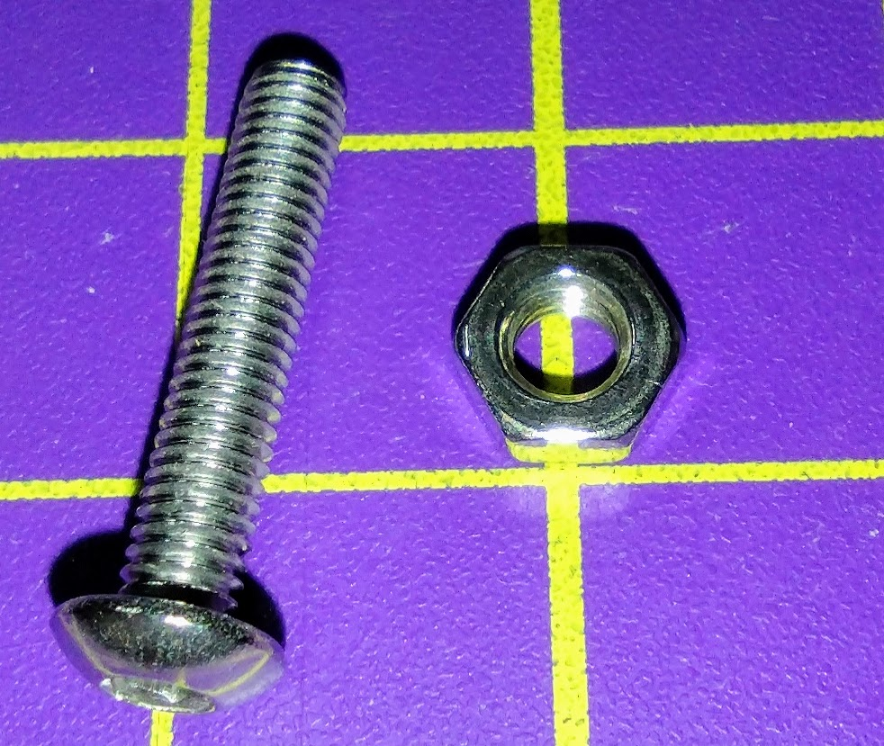
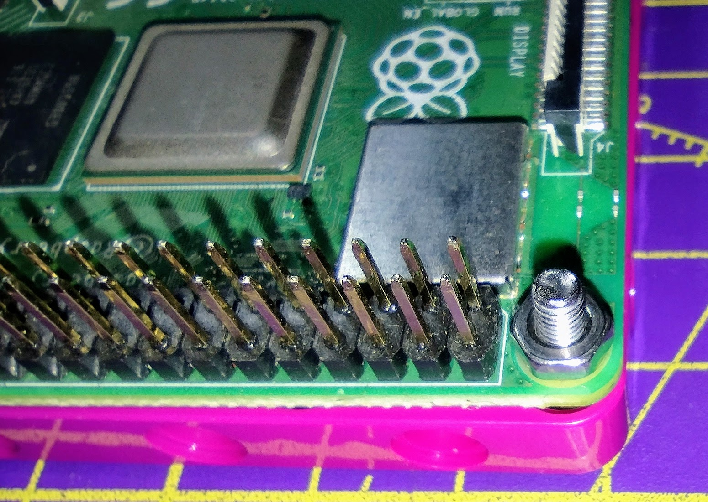

## 로봇 조립

이제 모터 코드가 작동하므로 실제 로봇을 구성하고 테스트할 차례입니다.

기본 설계는 다섯 가지 주요 요구 사항을 충족하도록 해야 합니다.

- 탑재된 Raspberry Pi 및 Build HAT
- 서로 평행하게 장착된 두 개의 모터
- 두 개의 바퀴
- 캐스터 또는 전면의 균형 포인트
- 배럴 커넥터가 있는 안전한 배터리 팩

M2 볼트와 너트를 사용하여 Raspberry Pi와 Build HAT를 LEGO® 부품에 고정할 수 있습니다.





[[[attach_rpi_to_lego]]]

배럴 잭에 연결된 배터리 팩을 사용하여 Raspberry Pi에 전원을 공급하고 Build HAT를 빌드할 수 있습니다. 최소 5개의 AA 배터리 또는 9V 배터리가 필요합니다.


다음 사진은 Raspberry Pi, Build HAT 및 배터리 팩을 통합하여 LEGO® 자동차를 제작할 수 있는 다양한 디자인 예시를 보여줍니다.


--- task ---

필요한 모든 LEGO® 요소를 사용하여 로봇을 구성하고 상상력을 발휘하세요.

--- /task ---

### 테스트

로봇이 조립되면 Android 장치에서 Bluetooth를 사용하여 테스트해야 합니다.

--- task ---

Raspberry Pi에 전원을 공급한 다음 `bt_car.py` 프로그램을 실행하세요. Android 기기에서 Bluetooth 및 Blue Dot 앱을 사용할 때 자동차가 잘 작동하는지 테스트합니다.

--- /task ---

자동차의 어느 쪽에 모터가 연결되었는지에 따라 코드를 변경해야 할 수도 있습니다.

다음으로 Raspberry Pi를 **헤드리스** 상태에서 실행할 수 있도록 해야 합니다. 즉, 모니터, 키보드 또는 마우스를 연결하지 않고도 코드를 실행할 수 있어야 한다는 말입니다.

우선, Raspberry Pi가 [WiFi 네트워크에 연결](https://www.raspberrypi.org/documentation/configuration/wireless/desktop.md)되어 있는지 확인합니다.

**cron** 이라는 프로그램을 사용하여 Raspberry Pi가 부팅될 때마다 Python 스크립트가 실행되도록 만들 수 있습니다.

--- task ---

키보드에서 <kbd>Ctrl</kbd>+<kbd>Alt</kbd>+<kbd>T</kbd> 를 눌러 터미널을 엽니다.

--- /task ---

--- task ---

`crontab -e` 를 터미널에 입력합니다. **crontab**처음 사용하는 경우 앞으로 사용할 에디터를 묻는 메시지가 표시됩니다.

```bash
pi@raspberrypi:~ $ crontab -e
no crontab for pi - using an empty one

Select an editor. To change this later, run 'select-editor'.
  1. /bin/nano        <---- easiest
  2. /usr/bin/vim.tiny
  3. /bin/ed

Choose 1-3 [1]: 
```

**vim** 을 사용해 본 경험이 없다면 `1을 선택하십시오. /bin/nano`.

--- /task ---

Nano 편집기가 열리고 기본 템플릿 파일이 표시될 것입니다.

--- task ---

커서 키를 사용하여 파일의 맨 아래로 스크롤해 보세요. 그런 다음 이 한 줄을 추가하면, 30초 동안 기다린 다음 `bt_car.py` 파일을 실행할 수 있습니다.

```bash
# m h  dom mon dow   command
@reboot sleep 30 && python3 /home/pi/bt_car.py
```

--- /task ---

--- task ---

Raspberry Pi를 재부팅하고 30초 동안 기다린 다음 Android 기기에서 Blue Dot 앱을 사용하여 자동차에 연결하고 제어를 해 봅니다.

--- /task ---


