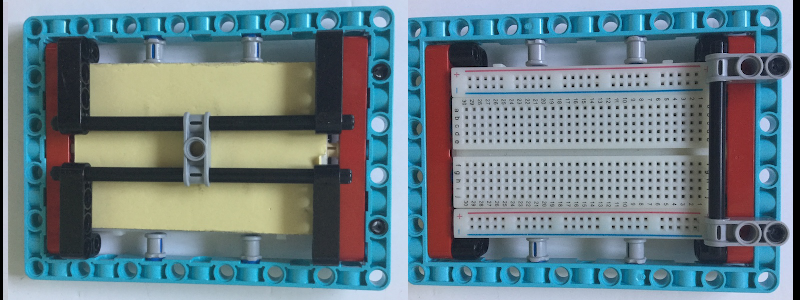
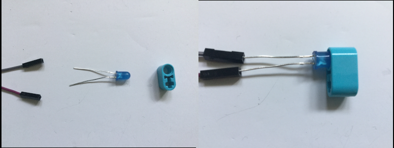

## LED 추가

LEGO® 부품에 있는 작은 구멍은 작은 LED를 고정하기에 딱 좋은 크기이므로 프로젝트에 쉽게 추가할 수 있습니다. 또는 브레드보드를 사용할 수 있습니다.

LEGO®를 사용하여 브레드보드를 장착하는 방법에는 여러 가지가 있습니다. 몇 가지 아이디어가 아래에 나와 있지만 사용 가능한 모든 방법을 사용할 수 있습니다.

작은 브레드보드를 사용하여 HAT 위에 있는 공간에 앉힐 수도 있습니다. 많은 브레드보드에는 바닥에 접착 스트립이 있어 HAT에 단단히 붙일 수 있지만 [Raspberry Pi 카메라](https://projects.raspberrypi.org/ko-KR/projects/getting-started-with-picamera) 를 프로젝트에 추가하려는 경우 카메라 케이블에 사용되는 슬릿을 일부 덮을 수 있습니다.

--- task ---

브레드보드를 사용하여 두 개 이상의 LED를 Raspberry Pi에 연결합니다. 아래 예시에서 핀 20과 21은 Raspberry Pi에서 사용됩니다.

--- /task ---

[[[rpi-gpio-pins]]]

[[[rpi-connect-led]]]

필요한 경우 추가 점퍼 리드를 추가하여 LED 범위를 확장할 수 있습니다.

또한 원하는 LEGO® 요소 에 LED를 삽입할 수 있습니다. LED의 다리가 너무 가깝거나 계속 닿아 있는 경우에는 합선을 방지하기 위해 절연 테이프를 활용해 LED의 다리를 절연할 수 있습니다.

--- task ---

코드를 변경하여 `gpiozero` 에서 `LED` 개체를 가져오고 LED를 설정합니다.

--- code ---
---
language: python 
filename: bt_car.py 
line_numbers: true 
line_number_start:
line_highlights: 4, 9, 10
---

from buildhat import Motor    
from bluedot import BlueDot    
from signal import pause     
from gpiozero import LED

motor_left = Motor('A')     
motor_right = Motor('B')     
dot = BlueDot()     
led_left = LED(20)     
led_right = LED(21)

--- /code ---

--- /task ---

--- task ---

자동차의 움직임에 따라 LED가 켜지도록 코드를 변경합니다. 아래 예시에서는, 차량이 후진하거나 정지할 때 두 LED가 모두 켜집니다. 차가 전진하면 꺼지도록 설정되어 있습니다. 차가 왼쪽으로 움직일 때 움직이는 방향(방향지시등) 을 뜻하는 왼쪽 LED가 깜박이고 차가 오른쪽으로 움직일 때 오른쪽 LED가 깜박입니다.

--- code ---
---
language: python 
filename: bt_car.py 
line_numbers: true 
line_number_start: 13
line_highlights: 16, 17, 23, 24, 30, 31, 37, 38, 44, 45
---

def stop():    
    motor_left.stop()     
    motor_right.stop()    
    led_right.on()     
    led_left.on()

def forward():    
    motor_left.start(-100)    
    motor_right.start(100)    
    led_right.off()    
    led_left.off()

def backward():    
    motor_left.start(100)    
    motor_right.start(-100)    
    led_right.on(0.2)    
    led_left.on(0.2)

def right():    
    motor_left.start(-100)    
    motor_right.start(-100)    
    led_right.blink(0.2)    
    led_left.off()

def left():    
    motor_left.start(100)    
    motor_right.start(100)    
    led_right.off()     
    led_left.blink(0.2)

--- /code ---

--- /task ---

상상력을 발휘하여 원하는 방식으로 LED를 켜거나 깜박일 수 있습니다.

--- save ---
