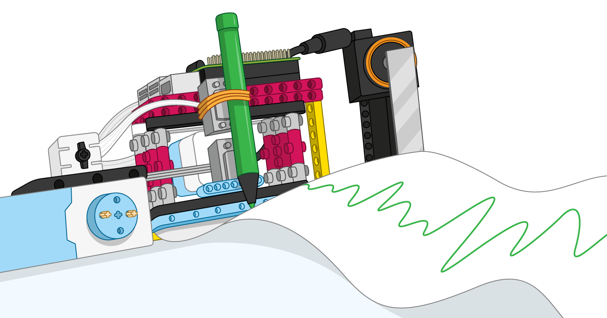

## 더 나아가기

If you would like to enhance your Bluetooth car, then you could think about adding more electronic components:

+ 빨간색과 파란색이 깜박이는 경찰 경광등 LED를 추가하거나, 자동차를 운전할 때 사용하는 헤드라이트를 추가합니다.

+ 많은 차량이 후진할 때 소리를 내므로 프로젝트에 버저를 추가할 수 있습니다.

+ 자동차가 장애물에 접근할 때 감지하여 충돌을 자동으로 멈추게 하는 초음파 거리 센서(UDS)를 제작하여 사용할 수도 있습니다!

If you are following the [Introduction to LEGO BuildHAT](https://projects.raspberrypi.org/en/pathways/lego-intro) pathway, you can move on to the [LEGO Data Plotter](https://projects.raspberrypi.org/en/projects/lego-plotter) project. 이 프로젝트에서는 종이에 그리는 데이터 플로터를 만들어 봅니다!

