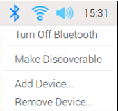
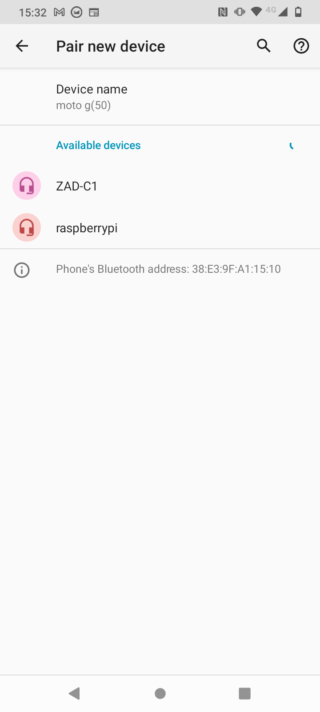
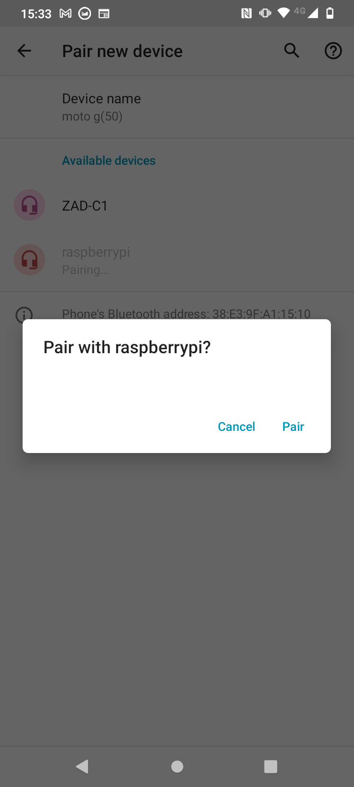
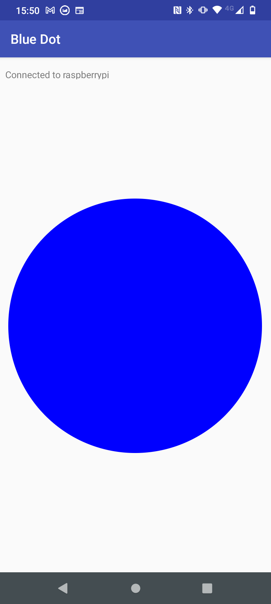

## Настрой и протестируй управление посредством Bluetooth

Для дистанционного управления автомобилем ты воспользуешься библиотекой Blue Dot и приложением для Android. Тебе нужно будет выполнить сопряжение raspberry pi и мобильного устройства только один раз. После этого они должны каждый раз легко соединяться.

--- collapse ---
---
title: Установка библиотеки Python Blue Dot
---

--- task ---

Открой окно твоего терминала. В командной строке введи
```
sudo pip3 install bluedot
```
и нажми <kbd>Ввод</kbd>.

--- /task ---

Вы должен увидеть, что твой терминал сообщит, что установлена последняя версия Blue Dot.

--- /collapse ---

### Сопряжение Raspberry Pi с твоим устройством Android

--- task ---

Щелкни значок Bluetooth в правом верхнем углу рабочего стола и убедись, что для Bluetooth установлено значение **Включено** и устройство **Доступно для обнаружения**.



--- /task ---

В зависимости от версии Android, которую ты используешь, действия на твоем устройстве могут незначительно отличаться, но должны быть примерно такими:

--- task ---

В **Настройки** найди настройки Bluetooth, а затем **Подключенные устройства**.


--- /task ---

--- task ---

Выбери **Подключить новое устройство**, а затем выбери свое устройство Raspberry Pi из показанных устройств.



Затем выбери **Подключить** в диалоговом окне.



--- /task ---

--- task ---

На Raspberry Pi тебе будет предложено принять запрос на сопряжение.


Нажатие на **OK** должно показать успешное сопряжение Raspberry Pi и устройств Android.


--- /task ---

Иногда тебя могут попросить подтвердить код, прежде чем ты получишь разрешение на сопряжение устройств.


### Тестирование Blue Dot

--- task ---

Создай новый файл Python на Raspberry Pi с именем bluedot_test.py со следующим кодом.

--- code ---
---
language: python filename: bluedot_test.py line_numbers: true line_number_start:
line_highlights:
---

from bluedot import BlueDot   
dot = BlueDot()

print('Жду...')   
dot.wait_for_press()    
print("Заработало!")

--- /code ---

--- /task ---

--- task ---

Запусти программу, а затем на своем устройстве Android открой приложение [Blue Dot](https://play.google.com/store/apps/details?id=com.stuffaboutcode.bluedot&hl=en_GB&gl=US). Первый экран покажет тебе список устройств Bluetooth, которые были сопряжены с твоим устройством.


--- /task ---

--- task ---

Нажми **raspberrypi** в меню, и ты увидишь большую синюю точку на экране. Коснись точки.



--- collapse ---
---
title: Bluedot не работает с моей Raspberry Pi
---

 Чтобы BlueDot могла подключиться к твоей Raspberry Pi, на Raspberry Pi должен быть запущен сервер. Это означает, что объект BlueDot (`dot = BlueDot()`) уже должен быть создан в твоей программе на Python и ожидать соединения.

 Убедись, что ты запускаешь свою программу, прежде чем пытаться подключиться к Bluedot, и что в ней нет ошибок.

--- /collapse ---

--- /task ---

--- task ---

На Raspberry Pi ты должен увидеть, что твоя программа приняла соединение Bluetooth и успешно ответила на нажатие синей точки.


--- /task ---
