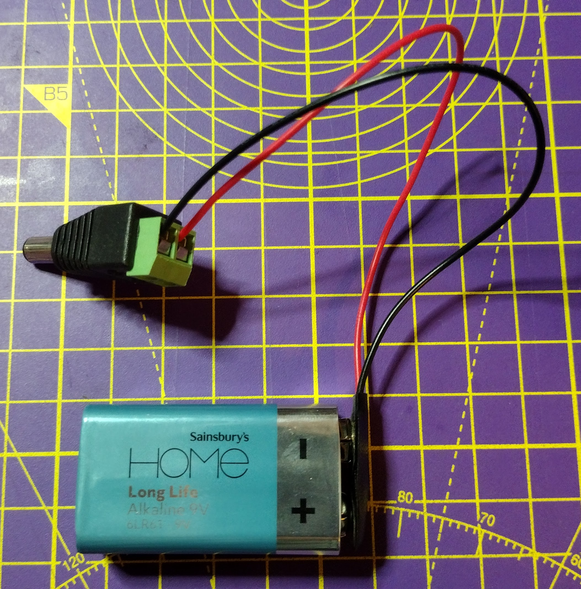
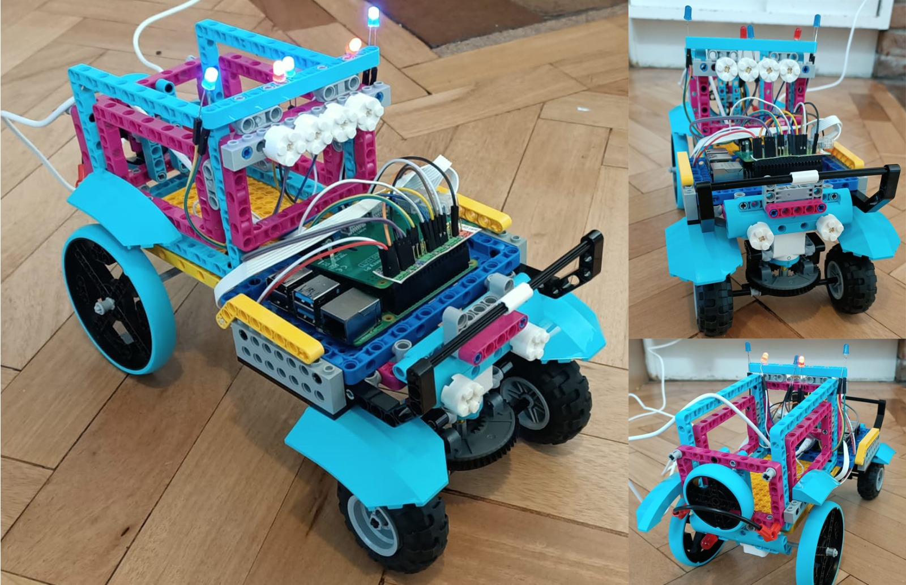

## Сборка твоего робота

Теперь у тебя есть рабочий код мотора, пришло время построить и протестировать твоего робота.

Базовый проект должен удовлетворять пяти основным требованиям:

- Смонтированные Raspberry Pi и Build HAT
- Два мотора, установленные параллельно друг другу
- Два колеса
- Кастер или точка баланса спереди
- Защищенный аккумуляторный блок с циллиндрическим разъемом

Raspberry Pi и Build HAT можно прикрепить к деталям LEGO® с помощью винтов и гаек M2.


[[[attach_rpi_to_lego]]]

Ты можешь питать Raspberry Pi и Build HAT от батареи, подключенной к разъему в виде цилиндра. Потребуется минимум пять батареек типа АА или батарея на 9 В.




На следующих фотографиях показаны различные варианты сборки автомобиля LEGO®, включающие в себя Raspberry Pi, Build HAT и аккумулятор.




--- task ---

Используй любые элементы LEGO®, которые у тебя есть, чтобы построить робота, и подключай свое воображение.

--- /task ---

### Тестирование

После того, как твой робот собран, ты должен протестировать его с помощью Bluetooth на твоем Android-устройстве.

--- task ---

Включи Raspberry Pi, а затем запусти программу `bt_car.py`. Проверь, работает ли твой автомобиль при использовании Bluetooth и приложения Blue Dot на вашем устройстве Android.

--- /task ---

Возможно, тебе придется внести изменения в твой код, в зависимости от того, с какой стороны автомобиля и каким образом подключены твои двигатели.

Затем тебе нужно заставить Raspberry Pi запускаться в **безголовом** режиме. Это означает запуск твоего кода без необходимости подключения монитора, клавиатуры или мыши.

Прежде всего, убедись, что твоя Raspberry Pi [подключена к сети Wi-Fi](https://www.raspberrypi.org/documentation/configuration/wireless/desktop.md).

Теперь ты можешь использовать программу под названием **cron**, чтобы твой скрипт на Python запускался каждый раз при загрузке Raspberry Pi.

--- task ---

Открой терминал, нажав <kbd>Ctrl</kbd>+<kbd>Alt</kbd>+<kbd>T</kbd> на клавиатуре.

--- /task ---

--- task ---

Введи `crontab -e` в окно терминала. Если ты впервые используешь **crontab**, он спросит тебя, какой редактор ты бы хотел использовать.

```bash
pi@raspberrypi:~ $ crontab -e
no crontab for pi - using an empty one

Select an editor. Чтобы изменить это позже, запусти «select-editor».
  1. /bin/nano        <---- самый простой
  2. /usr/bin/vim.tiny
  3. /bin/ed

Выберите 1-3 [1]: 
```

Если у тебя нет опыта работы с **vim**, выбери `1. /bin/nano`.

--- /task ---

Nano откроется и покажет файл шаблона по умолчанию.

--- task ---

Используй клавиши курсора, чтобы прокрутить файл до конца. Затем ты можешь добавить эту единственную строку, которая будет ждать 30 секунд, а затем запустит твой файл `bt_car.py`.

```bash
# m h  dom mon dow   command
@reboot sleep 30 && python3 /home/pi/bt_car.py
```

--- /task ---

--- task ---

Перезагрузи Raspberry Pi, подожди 30 секунд, а затем используй приложение Blue Dot на устройстве Android, чтобы подключиться к машинке и управлять ею.

--- /task ---


