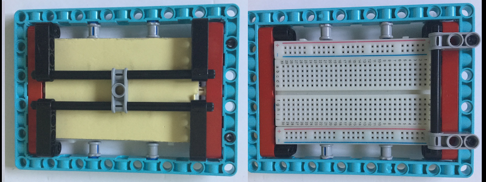

## Добавим несколько светодиодов

Отверстия в элементах LEGO® как раз подходят для небольших светодиодов, поэтому ты можешь легко добавить их в свой проект. Как вариант, можно использовать макетную плату.

Существует множество способов монтажа макетной платы с помощью LEGO®. Несколько идей показаны ниже, но ты можешь использовать любые доступные тебе элементы.

Ты можешь использовать небольшую макетную плату и поместить ее в пространство над Build HAT. Многие макетные платы имеют клейкую ленту в нижней части, которую ты можешь использовать, чтобы плотно приклеить ее к HAT, но обрати внимание, что она частично закроет щель, которая используется для кабеля камеры, если ты захочешь добавить [камеру Raspberry Pi](https://projects.raspberrypi.org/en/projects/getting-started-with-picamera) к твоему проекту.

--- task ---

Используй макетную плату для подключения двух или более светодиодов к Raspberry Pi. В приведенном ниже примере используются контакты 20 и 21 на Raspberry Pi.

--- /task ---

[[[rpi-gpio-pins]]]

[[[rpi-connect-led]]]

При необходимости ты можешь добавить несколько дополнительных перемычек, чтобы увеличить радиус действия светодиодов.

Кроме того, светодиоды можно вставить в элемент LEGO® по твоему выбору. Если ты обнаружишь, что ножки светодиодов расположены слишком близко друг к другу или продолжают соприкасаться, ты можешь изолировать одну из них с помощью изоленты, чтобы предотвратить короткое замыкание.

--- task ---

Дополни свой свой код, чтобы импортировать объект `LED` из `gpiozero` и настроить светодиоды.

--- code ---
---
language: python filename: bt_car.py line_numbers: true line_number_start:
line_highlights: 4, 9, 10
---

from buildhat import Motor    
from bluedot import BlueDot    
from signal import pause     
from gpiozero import LED

motor_left = Motor('A')     
motor_right = Motor('B')     
dot = BlueDot()     
led_left = LED(20)     
led_right = LED(21)

--- /code ---

--- /task ---

--- task ---

Дополни свой код так, чтобы светодиоды загорались в зависимости от движения автомобиля. В приведенном ниже примере оба светодиода загораются, когда автомобиль движется назад или останавливается. Они отключаются, когда машина движется вперед. Левый светодиод будет мигать, когда автомобиль движется влево, а правый светодиод будет мигать, когда автомобиль движется вправо.

--- code ---
---
language: python filename: bt_car.py line_numbers: true line_number_start: 13
line_highlights: 16, 17, 23, 24, 30, 31, 37, 38, 44, 45
---

def stop():    
motor_left.stop()     
motor_right.stop()    
led_right.on()     
led_left.on()

def forward():    
motor_left.start(-100)    
motor_right.start(100)    
led_right.off()    
led_left.off()

def backward():    
motor_left.start(100)    
motor_right.start(-100)    
led_right.on(0.2)    
led_left.on(0.2)

def right():    
motor_left.start(-100)    
motor_right.start(-100)    
led_right.blink(0.2)    
led_left.off()

def left():    
motor_left.start(100)    
motor_right.start(100)    
led_right.off()     
led_left.blink(0.2)

--- /code ---

--- /task ---

Ты можешь использовать свое воображение, чтобы зажечь или помигать светодиодами так, как ты хочешь.

--- save ---
