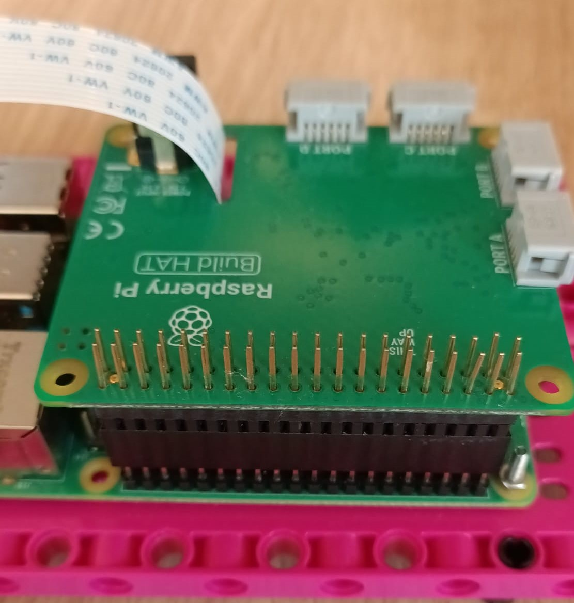

## 介绍

使用乐高（LEGO®）和 Raspberry Pi Build HAT 搭建机器人汽车，对其进行编程以便通过 Android 手机的蓝牙连接来控制它。 然后添加一些 LED 让您的朋友眼花缭乱。

[蓝牙](https://zh.wikipedia.org/wiki/%E8%97%8D%E7%89%99) 由英特尔的 Jim Kardach 于 1997 年提出。 在提出这个建议时，他正在阅读 Frans G. Bengtsson 的历史小说《长船》，该小说讲述了维京人和 10 世纪的丹麦国王 Harald Bluetooth。 蓝牙是哈拉尔德国王的绰号，就像蓝牙统一了通信协议一样，他将丹麦各部落统一为一个王国。

您将要：
+ 使用 Raspberry Pi Build HAT 控制乐高（LEGO®）Technic™ 马达
+ 使用蓝牙向Raspberry Pi发送信号
+ 了解如何在 Raspberry Pi 上使用 gpiozero 控制 LED

--- no-print ---

--- /no-print ---

您将建造一辆轮式汽车。 它的运动将由放置在汽车两侧的两个独立驱动的轮子决定，向前、向后和转弯。 您可以选择在汽车上添加 LED，以用作刹车灯、指示灯或前照灯。

--- print-only ---

--- /print-only ---

### 您将需要：

+ 运行最新桌面版 Raspberry Pi 操作系统的 Raspberry Pi
+ 一个Raspberry Pi Build HAT
+ 两个乐高（LEGO®）Technic™ 马达
+ 各种乐高（LEGO®）组件，包括两个车轮（我们从 [LEGO® Education SPIKE™ Prime 套件](https://education.lego.com/en-gb/product/spike-prime)中选择了一些）
+ 一台Android 手机或平板电脑
+ 5 节 AA 电池和一个带桶形插座的支架包

### 软件

+ 用于控制 Build HAT的BuildHAT Python 库
+ Blue Dot Python 库和Blue Dot Android 应用程序
+ gpiozero Python 库

--- collapse ---
---
title: 为教师提供的额外信息
---

您可以在 [此处](https://rpf.io/p/zh-CN/bt-robot-car-go){:target="_blank"}下载已完成的项目。

如果您需要打印此项目，请使用[适合打印的版本](https://projects.raspberrypi.org/zh-CN/projects/bt-robot-car/print){:target="_blank"}.

--- /collapse ---

在开始之前，您需要设置好您的 Raspberry Pi 并连接您的 Build HAT：

--- task ---

使用 M2 螺栓和螺母将您的 Raspberry Pi 安装到乐高(LEGO®) Build Plate上，请确保将Raspberry Pi 置于没有“边缘”的一侧：

 

--- /task ---

以这种方式安装 Raspberry Pi 可以轻松访问（Raspberry Pi的）端口和 SD 卡插槽。 Build Plate 可让您更轻松地将 Raspberry Pi 连接到仪表板的主要部件。

--- task ---

将 Build HAT 与 Raspberry Pi 对齐，请确保您可以看到 `This way up` 标签。 确保Build HAT准确滴覆盖了所有的 GPIO 引脚，然后用力按下。 （该示例使用了 [堆叠头](https://www.adafruit.com/product/2223){:target="_blank"}，所以有更长的引脚。）

 

--- /task ---

现在利用 Build HAT 上的 7.5V 桶形插孔为您的 Raspberry Pi 供电，这也将用于驱动马达。

--- task ---

如果您尚未设置您的 Raspberry Pi，请参照以下步骤：

[设置你的Raspberry Pi](https://projects.raspberrypi.org/zh-CN/projects/raspberry-pi-setting-up){:target="_blank"}

--- /task ---

--- task ---

Raspberry Pi 启动后，单击 Raspberry 菜单按钮，然后选择“首选项”，然后选择“Raspberry Pi 配置”，打开 Raspberry Pi 配置工具。

单击“interfaces”选项卡并调整串口设置，如下所示：

--- /task ---

--- task ---

您还需要按照以下说明安装 buildhat的 python 库：

--- collapse ---
---
title: 安装 buildhat Python 库
---

按下<kbd>Ctrl</kbd>+<kbd>Alt</kbd>+<kbd>T</kbd>，在 Raspberry Pi 上打开一个终端窗口。

在提示符后键入： `sudo pip3 install buildhat`

按 <kbd>回车</kbd> 并等待“installation completed”消息。

--- /collapse ---

--- /task ---