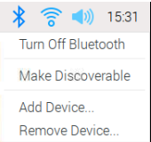
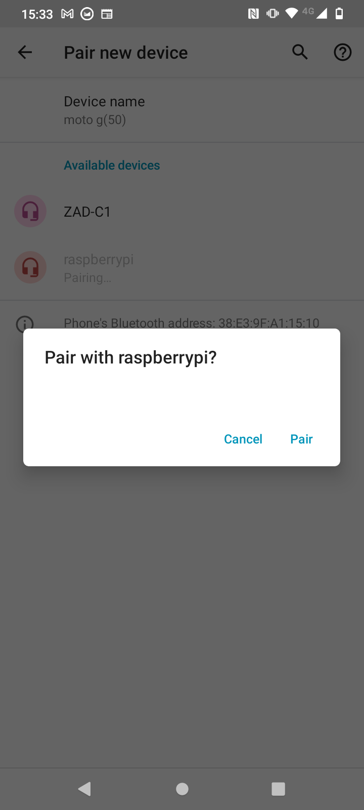
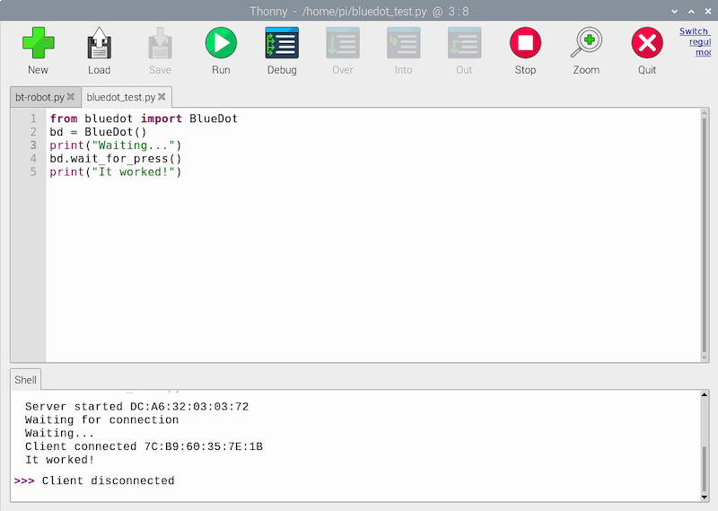

## 设置和测试蓝牙控制

要远程驾驶您的汽车，您将使用 Blue Dot 库和 Android 应用程序。 您只需要将Raspberry Pi和您的移动设备配对一次。 配对之后，他们应该每次都能轻松滴连接上。

--- collapse ---
---
title: 安装 buildhat Python 库
---

--- task ---

打开一个终端窗口。 在提示符后输入
```
sudo pip3 install bluedot
```
按 <kbd>回车</kbd>。

--- /task ---

在终端窗口上，您应该会最新版本的 Blue Dot已安装。

--- /collapse ---

### 将 Raspberry Pi 与 Android 设备配对

--- task ---

单击桌面右上角的蓝牙图标，确保蓝牙已 **打开** 并且设备为 **可被发现**。



--- /task ---

根据您运行的 Android 版本不同，在您的设备上执行的步骤可能略有不同，但应该大体一致：

--- task ---

在 **设置**中，找到您的蓝牙设置，然后选择 **连接的设备**。


--- /task ---

--- task ---

选择 **配对新设备** ，然后从显示的设备中选择您的 Raspberry Pi。


然后从对话框中 **配对**



--- /task ---

--- task ---

在 Raspberry Pi 上，系统会提示您接受配对请求。


单击 **OK** 后，Raspberry Pi 应显示和 Android 设备成功配对。


--- /task ---

有时您可能会被要求在允许配对设备之前确认匹配码。


### 测试 Blue Dot

--- task ---

在您的 Raspberry Pi 上创建一个名为 bluedot_test.py 的新 Python 文件，输入以下代码：

--- code ---
---
language: python
filename: bluedot_test.py
line_numbers: true
line_number_start: 
line_highlights: 
---

from bluedot import BlueDot   
dot = BlueDot()   

print('Waiting...')   
dot.wait_for_press()    
print("It worked!")

--- /code ---

--- /task ---

--- task ---

运行程序，然后在您的 Android 设备上打开 [Blue Dot](https://play.google.com/store/apps/details?id=com.stuffaboutcode.bluedot&hl=en_GB&gl=US) 应用程序。 第一个界面将显示已与您的设备成功配对的蓝牙设备的列表。


--- /task ---

--- task ---

从菜单中单击 **raspberrypi** ，然后您应该会在屏幕上看到一个大蓝点。 单击那个蓝点。


--- collapse ---
---
title: Bluedot 不能选择我的 Raspberry Pi
---

 为了让 BlueDot 能连接到您的 Raspberry Pi， Raspberry Pi 上需要运行一个服务器。 这意味着您必须在您的 Python程序中创建一个 BlueDot 对象 (`dot = BlueDot()`)，并等待连接。

 在尝试连接 Bluedot 之前，请确保您的程序正在运行并且没有错误。

--- /collapse ---

--- /task ---

--- task ---

在 Raspberry Pi 上，您应该看到您的程序已接受蓝牙连接并成功滴在您按下蓝点时响应。



--- /task ---
