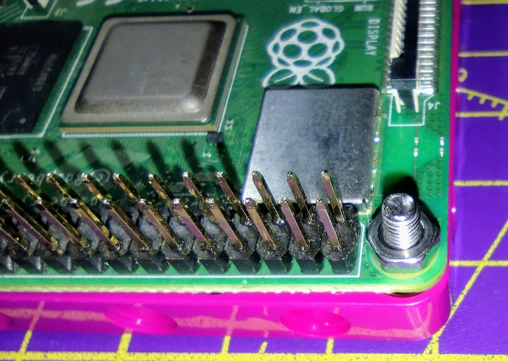
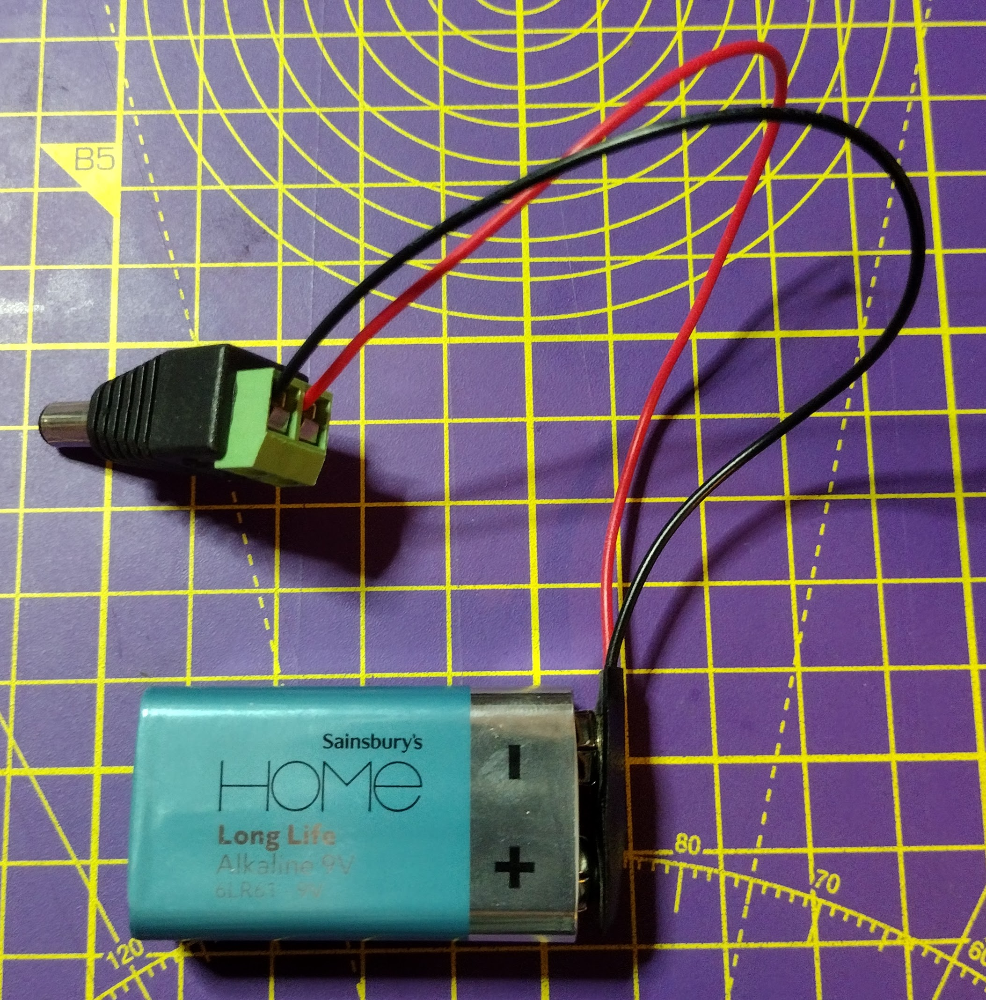

## 组装您的机器人

现在您控制马达的代码工作了，是时候构建并测试您的机器人了。

基本设计需要满足五个主要要求：

- 安装好的 Raspberry Pi 和 Build HAT
- 两个相互平行安装的马达
- 两个轮子
- 一个在前面的脚轮或支撑点
- 一个带有桶形连接器的安全电池组

Raspberry Pi 和 Build HAT 可以使用 M2 机器螺钉和螺母固定到乐高（LEGO®）上。




[[[attach_rpi_to_lego]]]

您可以通过桶形插孔使用电池为 Raspberry Pi 和 Build HAT 供电。 至少需要五节 AA 电池或一个 9V 电池。




以下照片展示了一些不同拼搭设计的乐高（LEGO®）汽车，其中包含了 Raspberry Pi、Build HAT 和电池组。


--- task ---

使用您拥有的任何乐高（LEGO®）组件并发挥您的想象力来构建机器人。

--- /task ---

### 测试

机器人组装好后，您应该使用蓝牙与您的 Android 设备进行测试。

--- task ---

启动您的Raspberry Pi，然后运行 `bt_car.py` 程序。 在您的 Android 设备上使用蓝牙和 Blue Dot 应用程序测试您的汽车是否正常工作。

--- /task ---

依据您马达在汽车上的位置和连接方式，您可能需要更改您的代码。

接下来，您需要让您的 Raspberry Pi  **无屏启动**。 这意味着无需连接显示器、键盘或鼠标即可运行代码。

首先，确保您的树莓派 [连接到 WiFi 网络](https://www.raspberrypi.org/documentation/configuration/wireless/desktop.md)。

现在，您可以使用一个名为 **cron** 的程序来让您的 Python 脚本在每次启动 Raspberry Pi 时运行。

--- task ---

按下<kbd>Ctrl</kbd>+<kbd>Alt</kbd>+<kbd>T</kbd>，在 Raspberry Pi 上打开一个终端窗口。

--- /task ---

--- task ---

在终端窗口中键入 `crontab -e` 如果这是您第一次使用 **crontab**，那么它会询问您要使用哪个编辑器。

```bash
pi@raspberrypi:~ $ crontab -e
no crontab for pi - using an empty one

Select an editor. To change this later, run 'select-editor'.
  1. /bin/nano        <---- 最简单的
  2. /usr/bin/vim.tiny
  3.  /bin/ed

Choose 1-3 [1]: 
```

除非您对**vim**很熟悉，否则请选择 `1。 /bin/nano`.

--- /task ---

Nano 启动后将显示默认模板文件。

--- task ---

使用光标键滚动到文件底部。 然后您可以添加这一行代码，它将在每次重启后，等待 30 秒，然后运行您的 `bt_car.py` 文件。

```bash
# m h  dom mon dow   command
@reboot sleep 30 && python3 /home/pi/bt_car.py
```

--- /task ---

--- task ---

重新启动您的 Raspberry Pi，等待 30 秒，然后使用 Android 设备上的 Blue Dot 应用程序连接并控制您的汽车。

--- /task ---


