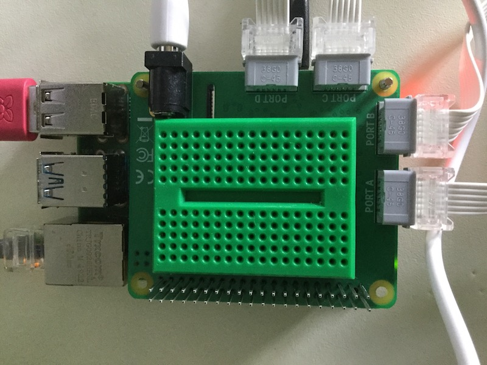
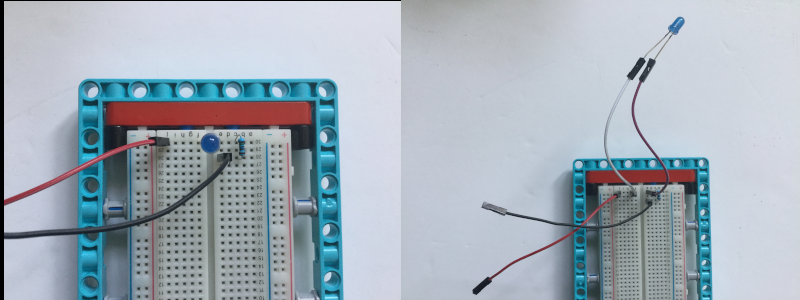

## 添加一些 LED

乐高（LEGO®）组件的孔正好适合安装小号 LED，因此您可以轻松地将它们添加到您的项目中。 或者，您可以使用面包板。

有很多方法可以在乐高（LEGO®）上安装面包板。 下面显示了一些想法，但您可以使用现有的任意组件。

您可以使用一个小面包板并将其放在 HAT 顶部的空间中。 许多面包板的底部都有一条胶带，您可以用它将其牢固地粘在 HAT 上。但请注意，如果您希望添加[Raspberry Pi 相机](https://projects.raspberrypi.org/zh-CN/projects/getting-started-with-picamera) 到您的项目中，面包板将会部分覆盖为相机数据线留出的缝隙。

--- task ---

使用面包板连接两个或更多 LED 到 Raspberry Pi。 在下面的示例中使用了Raspberry Pi的引脚 20 和 21。

--- /task ---

[[[rpi-gpio-pins]]]

[[[rpi-connect-led]]]

有需要的话，您可以添加一些额外的跳线来延长LED的连线。

此外，LED 可以插入您选择的乐高（LEGO®）组件中。 如果您发现 LED 的管脚靠得太近或相互接触，您可以用胶带将其中一个绝缘以防止短路。

--- task ---

更改您的代码，从 `gpiozero`中导入 `LED` 对象并设置 LED。

--- code ---
---
language: python 
filename: bt_car.py 
line_numbers: true 
line_number_start:
line_highlights: 4, 9, 10
---

from buildhat import Motor    
from bluedot import BlueDot    
from signal import pause     
from gpiozero import LED

motor_left = Motor('A')     
motor_right = Motor('B')     
dot = BlueDot()     
led_left = LED(20)     
led_right = LED(21)

--- /code ---

--- /task ---

--- task ---

更改您的代码，使 LED 可以依据汽车的运动而点亮。 在下面的示例中，当汽车向后移动或停止时，两个 LED 都会亮起。 当汽车向前移动时，它们会关闭。 当汽车向左移动时，左侧 LED 将闪烁，当汽车向右移动时，右侧 LED 将闪烁。

--- code ---
---
language: python 
filename: bt_car.py 
line_numbers: true 
line_number_start: 13
line_highlights: 16, 17, 23, 24, 30, 31, 37, 38, 44, 45
---

def stop():    
    motor_left.stop()     
    motor_right.stop()    
    led_right.on()     
    led_left.on()

def forward():    
    motor_left.start(-100)    
    motor_right.start(100)    
    led_right.off()    
    led_left.off()

def backward():    
    motor_left.start(100)    
    motor_right.start(-100)    
    led_right.on(0.2)    
    led_left.on(0.2)

def right():    
    motor_left.start(-100)    
    motor_right.start(-100)    
    led_right.blink(0.2)    
    led_left.off()

def left():    
    motor_left.start(100)    
    motor_right.start(100)    
    led_right.off()     
    led_left.blink(0.2)

--- /code ---

--- /task ---

您可以发挥您的想象力，以您想要的方式点亮或闪烁 LED。

--- save ---
